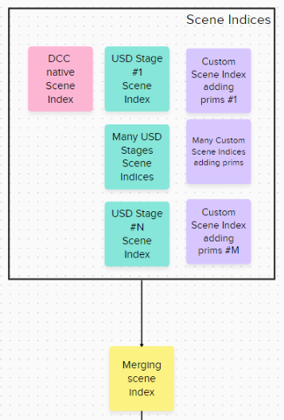

# Flow viewport toolkit

The Flow viewport toolkit  is an API for clients to customize the Hydra viewport.

## About the API
-   It is based on  **Hydra 2.0** and leverages the scene index mechanisms, it was not designed to be used with a Hydra 1.0 (scene delegate).
-   It is located in the [Flow viewport toolkit folder](../lib/flowViewport/API).

## What can we do with the API ?

 - Add  Hydra primitives which are neither related to a usd stage nor are DCC native data through what we call a **data producer scene index**.
 - Apply a **filtering scene index** to all primitives. Even if they are from another scene index including DCC native data, USD stages or a custom data producer scene index. 
 - Get information about the Hydra viewports and which render delegate they use
 - Get the version of the API
 
 Each of the domain above is a separate C++ interface with only a few functions in it.

## What is the Flow viewport toolkit merging scene index ?

To be able to do filtering on all data from the DCC native data, USD stages and custom data producer scene indices adding new primitives, we use a merging scene index which gathers all scene indices into a single scene index, please see the following :

It's not the native Hydra merging scene index which you find in the HdRenderIndex class.
You may also have a look at the implementation of the *[MergingSceneIndex](../lib/flowViewport/sceneIndex/fvpMergingSceneIndex.cpp)* class.

## Filtering Hydra primitives

Hydra has the notion of a filtering scene index. It is a scene index which takes as an input another scene index. The input scene index can be of any type : a retained scene index, a data producer scene index, another filtering scene index etc.  So you create a chain of scene indices.

When the filtering scene index is asked to provide a certain primitive in its *GetPrim* method, it looks into the input scene index for that primitive, it can potentially modify the primitive's attributes or completely replace it by another custom primitive or just return the input scene index's primitive unmodified.
You can have a look at [an example of filtering scene index](../lib/flowViewport/API/samples/fvpFilteringSceneIndexExample.cpp).

The interface to filter primitives is called *[FilteringSceneIndexInterface](../lib/flowViewport/API/fvpFilteringSceneIndexInterface.h)* which is used to register/unregister a *[FilteringSceneIndexClient](../lib/flowViewport/API/fvpFilteringSceneIndexClient.h)*.

To get an instance of the *FilteringSceneIndexInterface* class, please use :

    Fvp::FilteringSceneIndexInterface& filteringSceneIndexInterface = Fvp::FilteringSceneIndexInterface::get();

The filtering scene indices are applied after the Flow viewport toolkit [MergingSceneIndex](../lib/flowViewport/sceneIndex/fvpMergingSceneIndex.cpp), so they apply to all scene indices (USD Stages scene indices, DCC native data scene indices, custom data producer scene indices).

The *[FilteringSceneIndexClient](../lib/flowViewport/API/fvpFilteringSceneIndexClient.h)* class is a functor. It is not owned by the *FilteringSceneIndexInterface* when you register it.

It contains a :
- display name which is a name  associated with your filtering scene index, it is only used as an information and can be anything.
- category which is a container in which you want your filtering scene index (or scene index chain) to go to. Note : the filtering scene indices inside a Category don't have any specific priority when they are called.
-   The renderer names to which your filtering scene index applies. Say "GL, Arnold" for applying this filter to Storm and the Arnold render delegates. Note : using *FvpViewportAPITokens->allRenderers* means applies to all render delegates.
-   A DCC node as a *void** , dccNode is specific to a DCC (like Maya). For Maya it is a *MObject** DAG node. If you provide a non null pointer, we automatically track some events from the DCC node such as node deleted/undeleted or the visibility attribute updates.  When the node is present and visible, we automatically apply the filtering scene index. And when it  is deleted or not visible, we remove the filtering scene index, so no filtering is happening in that case.  It is a convenient way for you to control the filtering through a Maya node. If it is a *nullptr*, we always apply the filtering scene index until you unregister it.

The implementation can be found in the *[FilteringSceneIndexInterfaceImp](../lib/flowViewport/API/interfacesImp/fvpFilteringSceneIndexInterfaceImp.cpp)*  and in the *[FilteringSceneIndicesChainManager](../lib/flowViewport/API/perViewportSceneIndicesData/fvpFilteringSceneIndicesChainManager.cpp)* classes.

## Adding Hydra primitives
To add new primitives in a viewport, we created an interface called *[DataProducerSceneIndexInterface](../lib/flowViewport/API/fvpDataProducerSceneIndexInterface.h)*. It is used to manage data producer scene indices in a Hydra viewport. A data producer scene index is a scene index that adds primitives. 
These new primitives are created without the need of a DCC native object or a USD stage. You can create them from scratch.
To get an instance of the DataProducerSceneIndexInterface class, please use :

    Fvp::DataProducerSceneIndexInterface& dataProducerSceneIndexInterface = Fvp::DataProducerSceneIndexInterface::get();
This interface lets you :
-   Add a data producer scene index
-   Remove a data producer scene index previously added through this interface

The data producer scene index added will be merged by our [Flow viewport merging scene index](../lib/flowViewport/sceneIndex/fvpMergingSceneIndex.cpp) so it gets populated with all primitives coming from the DCC native data, USD stages or other custom data producer scene indices.
When adding primitives through *[Fvp::DataProducerSceneIndexInterface::addDataProducerSceneIndex](../lib/flowViewport/API/fvpDataProducerSceneIndexInterface.h#L75)*
You provide :

 - a *HdSceneIndexBaseRefPtr* which is the scene index producing primitives (it could also be the last scene index of a scene index chain, as soon as it creates some primitives)
 - a *SdfPath* which is a prefix you want to add to all your data producer scene index primitives. Note : if you don't want any prefix, pass *SdfPath::AbsoluteRootPath()* to this parameter.
 - a dccNode is a *MObject** from a DAG node for Maya. If you provide a no null pointer, we automatically track some events from attributes such as transform or visibility updated and apply this change to the primitives from the data producer scene index. If the node gets deleted, we remove the scene index primitives from the merging scene index. If this parameter is a *nullptr*, we won't do anything if the node's attributes changes or the node gets deleted. Basically, this is a way for you to set the DCC node as a parent node for all your primitives from the scene index.
 - a hydraViewportId which is a Hydra viewport string identifier to which your data producer scene index needs to be associated to. This is a way to add your primitives to only one viewport. Note : set it to *PXR_NS::FvpViewportAPITokens->allViewports* to add this data producer scene index to all viewports. To retrieve a specific hydra viewport identifier, please use the *[InformationInterface](../lib/flowViewport/API/fvpInformationInterface.h)* class.
 - a rendererNames which are the Hydra renderer (render delegate)  names to which this scene index should be added. This is only used when hydraViewportId above is set to *PXR_NS::FvpViewportAPITokens->allViewports*, meaning you want to add this scene index to all viewports that are using these renderers. Note : to apply to multiple renderers, use a separator such as : "GL, Arnold". We are actually looking for the render delegate's name in this string. Set this parameter to *PXR_NS::FvpViewportAPITokens->allRenderers* to add your scene index to all viewports whatever their renderer is.
An example of data producer scene index can be found in [DataProducerSceneIndexExample](../lib/flowViewport/API/samples/fvpDataProducerSceneIndexExample.cpp).

## Get Hydra viewports information
The interface to get Hydra viewports information is called *[InformationInterface](../lib/flowViewport/API/fvpInformationInterface.h)*.
To get an instance of the InformationInterface class, please use :

    Fvp::InformationInterface& informationInterface = Fvp::InformationInterface::Get();

It can be used to  :
 - Register /unregister a functor which is the *[Fvp::InformationClient](../lib/flowViewport/API/fvpInformationClient.h)* class to register callbacks when a new Hydra viewport is created/deleted.
 - Get the existing Hydra viewport information via the [Fvp::InformationInterface::GetViewportInformation](../lib/flowViewport/API/fvpInformationInterface.h#L100) method

The information we provide from a Hydra viewport is in the  *[Fvp::InformationInterface::ViewportsInformation](../lib/flowViewport/API/fvpInformationInterface.h#L43)* struct and contains (at the time of this writing):

 - a viewportId which is a Hydra viewport string identifier which is unique for all hydra viewports during a session.
 - a cameraName which is the name of the camera/viewport when the viewport was created, it is not updated if the camera's name changes.
 - a rendererName which is the Hydra viewport renderer name (example : "GL" for Storm or "Arnold" for the Arnold render delegate)

This struct may be extended in the future to contain more information.

## Get Flow viewport toolkit version
This is to get the version of the  API through the *[Fvp::VersionInterface](../lib/flowViewport/API/fvpVersionInterface.h)* class.
To get an instance of the *VersionInterface* class, please use :

    Fvp::VersionInterface& versionInterface = Fvp::VersionInterface::Get();

You get the version as semantic versioning  : majorVersion, minorVersion and patchLevel.

## Samples
The API contains examples which are Maya projects on how to filter and add primitives and get viewport information, please see [Flow viewport API examples](../lib/mayaHydra/flowViewportAPIExamples).

