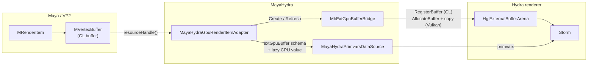
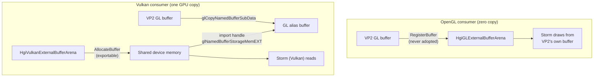
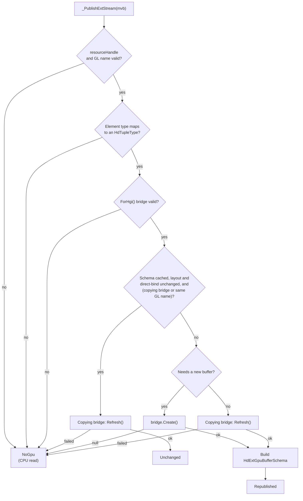
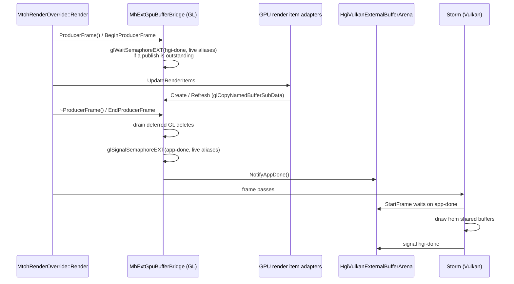

# GPU Buffer Sharing

This document describes the state of GPU buffer sharing in MayaHydra as of
October 2026. For the general render item data flow that this feature plugs
into (`MRenderOverride`, `MDataServerOperation`, render item adapters), read
[mayaHydraDetails.md](mayaHydraDetails.md) first.

GPU buffer sharing lets the Hydra renderer draw Maya geometry straight out of
the vertex buffers that Viewport 2.0 (VP2) has already uploaded to the GPU,
instead of mapping those buffers back to the CPU, copying them into `VtArray`
primvars, and having the renderer upload them again.

## Overview

Without sharing, every render item adapter reads each VP2 vertex stream with
`MVertexBuffer::map()` and stores it as a CPU array (`_positions`, `_normals`,
`_uvs`, `_tangents`). The renderer then pulls those arrays through the scene
index and uploads them into its own GPU buffers. For a deforming mesh that is
a GPU-to-CPU readback plus a CPU-to-GPU upload, per stream, per frame.

With sharing, the adapter instead publishes a small description of the VP2 GPU
buffer — which buffer, element type, count, offset and stride — as an
`HdExtGpuBufferSchema` container on the primvar. A renderer that understands
that schema (Storm, through the Hgi external buffer arena) binds or copies the
GPU buffer directly. A renderer that does not understand it still gets a CPU
value, read lazily from the GPU only when it is actually asked for.



## Components

| Component | File | Role |
| --- | --- | --- |
| Build detection | `cmake/modules/FindUSD.cmake` | Defines `USD_HAS_GPU_BUFFER_SHARING` and `USD_HAS_HGI_VULKAN` |
| Adapter selection | `sceneIndex/mayaHydraSceneIndex.cpp` | Picks the GPU or CPU render item adapter per render item |
| GPU render item adapter | `adapters/gpuRenderItemAdapter.{h,cpp}` | Publishes VP2 streams as external buffers, decides dirtiness |
| Bridge | `adapters/mhExtGpuBufferBridge.{h,cpp}` | Turns a VP2 GL buffer into an `HgiExternalBuffer` the renderer's Hgi can read |
| Primvar data source | `sceneIndex/mayaHydraPrimvarDataSource.cpp` | Overlays the `extGpuBuffer` child and the lazy CPU value on each primvar |
| Frame bracketing and teardown | `mayaPlugin/renderOverride.cpp` | Opens the producer frame around render item updates; shuts the bridge down |

All paths above are relative to `lib/mayaHydra/hydraExtensions/`, except the
CMake module and `renderOverride.cpp`.

### Build-time gating

The feature only exists when the USD build provides the consumer side.

- `USD_HAS_GPU_BUFFER_SHARING` is set when `pxr/imaging/hd/extGpuBufferSchema.h`
  exists in the USD install. It is a `PUBLIC` compile definition of
  `mayaHydraLib`, and also defined for `flowViewport`. Without it, none of the
  code in this document is compiled and every render item uses the CPU path.
- `USD_HAS_HGI_VULKAN` is set when the USD package exports the `hgiVulkan`
  target. Without it, only the OpenGL route of the bridge is compiled.

### Runtime settings

| Setting | Default | Meaning |
| --- | --- | --- |
| `MAYAHYDRA_GPU_BUFFER_SHARING` | `true` | Master switch. When false, no render item gets the GPU adapter |
| `MAYAHYDRA_GPU_BUFFER_SHARING_MODE` | `hybrid` | `direct`, `batch` or `hybrid`; see [Binding modes](#binding-modes) |
| `TF_DEBUG=MAYAHYDRALIB_ADAPTER_GPU_BUFFER_SHARING` | off | Per-stream log of whether each stream was shared, and why not when it was not |

Both environment settings are read once and cached for the session.

The debug code matters more than usual here: every failure in the sharing path
falls back to the CPU primvar, which renders the same image. The log is the
only way to tell sharing from copying.

## Adapter selection

When `MayaHydraSceneIndex::UpdateRenderItems` sees a new render item, it asks
`MayaHydraGpuRenderItemAdapter::IsEligible(ri, GetHgi())`. A render item is
eligible when all of the following hold:

1. `MAYAHYDRA_GPU_BUFFER_SHARING` is enabled.
2. The primitive is triangles, triangle strip, lines or line strip, i.e. it
   becomes an `HdMesh` or `HdBasisCurves`. Points are excluded because point
   render items are not populated by `UpdateFromDelta` yet.
3. `MhExtGpuBufferBridge::ForHgi(hgi)` returns a valid bridge (see below).

Eligible items get a `MayaHydraGpuRenderItemAdapter`; all others get the plain
`MayaHydraRenderItemAdapter`. The GPU adapter derives from the CPU one and
overrides a small set of protected hooks, so the topology, material, transform
and visibility handling in `UpdateFromDelta` is shared:

| Hook | CPU adapter | GPU adapter |
| --- | --- | --- |
| `_BeginGeometryUpdate` | no-op | Decides direct-bind for this update (hybrid promotion) |
| `_ReadVertexStream` | `map()` into a `VtArray` | Tries to share; falls back to the base class on failure |
| `_EndGeometryUpdate` | Dirty every stream on geometry change | Withdraws vanished streams; dirties only what must be re-pulled |
| `_HasStoredPositions` / `_StoredPositionCount` | CPU array | CPU array or published external stream |
| `_ResolveBounds` | Render item bounding box | Falls back to the DAG node bounding box when the render item's is empty |
| `_TopologyNeedsRebuild` | Always | Only when connectivity changed or nothing is cached |

The bounds fallback exists because GPU-backed render items often report an
empty `MRenderItem::boundingBox()` (for example while a scene is still
loading), and there are no CPU points to compute bounds from. Without it the
prim would be culled.

The topology rebuild check exists because Maya raises `MVS_changedGeometry`
every frame during deformation. Rebuilding the topology on those frames would
rescan the full index array for nothing, since no topology dirty is emitted.

## Bridge negotiation

`MhExtGpuBufferBridge::ForHgi(hgi)` is the whole capability negotiation. It
returns one of three kinds:

| Kind | Condition | Copies |
| --- | --- | --- |
| `OpenGL` | VP2 draws with OpenGL and the renderer's Hgi is OpenGL with an `HgiGLExternalBufferArena` | None (zero copy) |
| `Vulkan` | VP2 draws with OpenGL and the renderer's Hgi is Vulkan with an `HgiVulkanExternalBufferArena` | One GPU-side copy per refresh |
| None | VP2 is not on OpenGL (for example Metal on macOS), or the Hgi has no external buffer arena | Not shareable; CPU path |

VP2's draw API is checked with `MRenderer::drawAPI()` rather than inferred from
the buffer handle, because `MVertexBuffer::resourceHandle()` is an opaque
pointer whatever the backend, and reading a Metal pointer as a GL name would
bind an unrelated object.

The bridge is a cheap value type: it holds a raw pointer to the arena that the
Hgi owns, and `GetExternalBufferArena` is a get-or-create lookup. A bridge is
therefore constructed per publish rather than cached.

### Why the two routes differ

OpenGL can import memory that another API exported (`GL_EXT_memory_object`),
but it cannot export its own allocations, and the memory behind a GL buffer is
fixed when the buffer's storage is created. VP2 allocated its buffers with
ordinary GL storage long before MayaHydra sees them, so a Vulkan consumer can
never address them directly.

The Vulkan route therefore inverts ownership:

1. The Vulkan arena allocates exportable memory (`AllocateBuffer`).
2. The bridge imports that memory into GL (`glImportMemoryWin32HandleEXT` or
   `glImportMemoryFdEXT`) and binds a GL buffer over it at the suballocation's
   offset (`glNamedBufferStorageMemEXT`).
3. On every create or refresh, the bridge copies Maya's buffer into that GL
   alias with `glCopyNamedBufferSubData`. This copy stays on the GPU.



### OpenGL route

`Create` calls `HgiGLExternalBufferArena::RegisterBuffer` on Maya's GL buffer
name. The buffer is registered, never adopted: VP2 owns it and recycles it on
its own schedule, so the arena must never delete it.

Registration is safe because VP2 and Storm share a single GL context. Commands
on one context execute in issue order, so a buffer VP2 recycles after the draw
that read it is ordered after that read, and the driver defers the actual
deletion until the GPU is done.

`Refresh` is a no-op: the renderer is already looking at Maya's memory, so a
rewrite in place is visible at the next draw.

### Vulkan route

`Create` allocates through the arena, imports the allocation into GL, and
copies Maya's bytes in. The GL objects (memory object and alias buffer) are
attached to the `HgiExternalBuffer` as its keepalive, so they live exactly as
long as the allocation they alias. `Refresh` repeats the copy into the existing
alias.

Details that the implementation depends on:

- **One GL memory object per Vulkan memory block.** VMA suballocates many
  buffers from one block, and the export handle names the whole block.
  Importing once per buffer would import the full block (for example 32 MiB)
  once per buffer and run GL out of memory. The bridge keys imported memory
  objects on the arena's `memoryBlockId` and reference-counts them. An Hgi that
  reports no block ID still works, but each buffer then imports its own copy of
  the block, and the bridge warns once.
- **Export handle ownership.** On Windows, the NT handle is kept open until the
  memory object is destroyed; closing it right after import left the aliases
  reading nothing. On POSIX, a successful import consumes the file descriptor.
  Handles that are not consumed (for example when the block was already
  imported) are closed immediately so they do not leak.
- **Deferred GL deletion.** The last reference to an external buffer can be
  dropped by `HgiExternalBufferArena::GarbageCollect()` on any thread. The
  keepalive deleter therefore only queues the GL objects; the queue is drained
  on Maya's thread, with Maya's context current, from `Create` and at the end
  of every producer frame.
- **Copy size versus allocation size.** See [Layout](#layout).
- **GL error hygiene.** Pending GL errors left by Maya are drained before each
  import and copy, so a stale error does not fail a good copy.

## Publishing a stream

`_ReadVertexStream` handles positions, normals (only when Maya supplies
normals), UVs and tangents (meshes only). For each, `_ShareStream` calls
`_PublishExtStream`, which returns one of:

| Result | Meaning | Effect on the stream |
| --- | --- | --- |
| `Republished` | First publish, or the buffer, layout or direct-bind permission changed | New schema; primvar dirtied |
| `Unchanged` | Same layout and permission; for the OpenGL route also the same GL buffer | Cached schema kept; Vulkan route refreshes the copy |
| `NoGpu` | Cannot be shared this time | External stream cleared; base class CPU read runs |



### Buffer identity

The two routes disagree on whether Maya's GL buffer name is part of what was
published:

- **OpenGL (zero copy):** the renderer is bound to Maya's buffer itself, so a
  new GL name is a different allocation and must be republished with a new
  external buffer.
- **Vulkan (copying):** the renderer is bound to the bridge's own allocation,
  so a new GL name only changes where the copy reads from. VP2 recycles buffer
  names from frame to frame during playback; treating each one as a new
  publication would allocate a fresh exportable buffer per object per frame
  and exhaust the device's allocation count. Only a layout change, which would
  outgrow the allocation, creates a new buffer.

When an existing buffer can be reused (for example only the direct-bind
permission flipped), it is reused rather than recreated. Publishing the same
stream as two different buffer objects would cost the renderer the
aggregation it keys on buffer identity.

### Layout

`_GetExtLayout` converts the VP2 descriptor to the schema's fields.
`MVertexBufferDescriptor::offset()` and `stride()` are in data-type units, so
they are multiplied by `dataTypeSize()` to get bytes. A zero stride means
tightly packed, which is the same rule the consumer applies.

Two sizes are derived because `MVertexBuffer` does not expose its allocation
size:

- `byteSize = byteOffset + numElements * stride` is the size reported to the
  arena. The consumer bounds-checks the published layout against it
  (`HdStExtGpuBufferDesc::FromSchema`). An underestimate does not fail loudly;
  it silently drops the stream back to the CPU path.
- `copyByteSize = byteOffset + (numElements - 1) * stride + elementSize` is
  the exact span the stream occupies in Maya's buffer. On an interleaved buffer
  `byteSize` can exceed Maya's real allocation, which is harmless for a bounds
  check but would make a copy read out of range. The Vulkan route copies
  `copyByteSize`.

### Ownership and lifetime

- The adapter's `_ExtStream::buffer` holds the only strong reference on the
  producer side.
- The schema placed in the scene index holds a **weak** reference
  (`HgiExternalBufferWeakPtr`). A scene index that caches or flattens the
  container therefore cannot pin GPU memory.
- The consumer takes its own strong reference while it may bind the buffer,
  and the arena releases its reference only from `GarbageCollect()`, after the
  GPU work that used it has retired. Replacing or clearing `_ExtStream::buffer`
  is therefore safe while the renderer is still drawing with the old buffer.

### Withdrawing streams

VP2 can release a render item's buffers (a display-mode switch does) and reuse
the names. On every geometry or topology change, `_EndGeometryUpdate` checks
which semantics are still present in the `MGeometry` and clears any published
stream that is gone, dirtying that primvar. Without this the cached schema
would keep naming a GL buffer VP2 no longer guarantees.

## Binding modes

The published schema carries `allowDirectBind`. When true, Storm may bind the
external buffer directly in the draw (a direct-bind buffer array range); when
false, Storm copies it GPU-to-GPU into its own aggregated vertex buffers so the
prim can take part in indirect-draw batching.

| Mode | `allowDirectBind` | Static meshes | Deforming meshes |
| --- | --- | --- | --- |
| `direct` | always true | No batching | No per-frame copy on the Storm side |
| `batch` | always false | Batched | One Storm-side blit per dirty primvar per frame |
| `hybrid` (default) | false until the mesh deforms, then true | Batched | Promoted to direct after the first deform |

In hybrid mode, `_BeginGeometryUpdate` promotes a mesh the first time it
reports a geometry or topology change after its positions were already
published (so the initial population frame does not count). The promotion is
sticky. No dirty is emitted at promotion time: the next `_PublishExtStream`
sees that the cached `allowDirectBind` is stale and republishes, which dirties
the stream.

## Dirty notification

The general per-primvar dirty policy is described in
[render_delegate_topology_vs_deformation.md](render_delegate_topology_vs_deformation.md).
GPU sharing narrows it further, because a stable direct-bound stream needs no
re-pull at all: the renderer reads the deformed bytes in place.

A shared stream dirties its primvar when any of these is true:

- the publish result was `Republished`;
- the stream is not direct-bound (batch mode or hybrid before promotion), since
  Storm must re-blit it;
- the stream is positions and Hydra computes normals (Maya normals disabled),
  since moved points must drive the normals recompute;
- a consumer has pulled the lazy CPU value for that primvar (see below).

In addition, `_EndGeometryUpdate` dirties streams that were not supplied by VP2
only when Maya flags both geometry and topology changes, because a stream can
only appear or change shape on a topology change. On a deformation-only frame,
streams that VP2 did not supply stay clean.

## Scene index integration

`MayaHydraPrimvarsDataSource::Get` builds each primvar as usual, then, for a
`MayaHydraGpuRenderItemAdapter` that has a schema for that primvar:

1. Replaces `primvarValue` with `_ExtGpuBufferLazyValueDataSource`.
2. Overlays the `HdExtGpuBufferSchema` container as the primvar's
   `extGpuBuffer` child, where the consumer finds it with
   `HdExtGpuBufferSchema::GetFromParent`.

```text
primvars/
  points/
    primvarValue   -> _ExtGpuBufferLazyValueDataSource (reads GPU on demand)
    interpolation  -> vertex
    role           -> point
    extGpuBuffer/
      externalResource -> HdExternalBufferPtr (weak)
      numElements, elementType, byteOffset, byteStride, allowDirectBind
```

### Lazy CPU fallback

Building the lazy data source does not touch the GPU. Only `GetValue()` reads
the buffer, through `GetExtGpuBufferLazyValue`. This serves consumers that
ignore `extGpuBuffer`, such as other render delegates, scene browsers, or
scene index filters that read point positions.

The read happens on whatever Hydra worker thread pulls the value, so it cannot
use `MVertexBuffer::map()`, which Maya restricts to the main thread for most
buffers. Instead:

- On the first publish, while Maya's context is current, the adapter creates a
  private GL context in Maya's share group: a hidden window with WGL on
  Windows, a 1x1 pbuffer with GLX on Linux. Lazy readback is not supported on
  other platforms.
- `GetValue()` makes that context current under a mutex and reads Maya's
  buffer with `glGetNamedBufferSubData`, de-interleaving when the stride is
  larger than the element.

The first lazy read of a primvar sets a bit in
`_lazyCpuBufferTriggeredMask`. From then on that primvar is dirtied on every
change, because the adapter is shared by all viewports and some consumer now
depends on the CPU value being current.

## Frame synchronization (Vulkan route)

The OpenGL route needs no explicit synchronization because producer and
consumer share one GL context. The Vulkan route writes into memory the Vulkan
renderer reads, from a different API, so the two sides are bracketed with a
pair of binary semaphores created by the arena and imported into GL:

- **app-done**: signalled by MayaHydra when this frame's copies are written.
- **hgi-done**: signalled by the Vulkan renderer when it has finished reading.

`MtohRenderOverride::Render` scopes an `MhExtGpuBufferBridge::ProducerFrame`
around `MayaHydraSceneIndex::UpdateRenderItems`, before the frame passes run.



Rules the implementation follows:

- **Open a producer frame every consumer frame**, even when the scene did not
  change. The signal and wait also move the shared buffers between Vulkan's
  queue family and the external (GL) side; skipping a frame leaves them
  released, and the renderer would read undefined contents.
- **Notify before the consumer frame starts.** The arena encodes its wait in
  `StartFrame` only for an epoch it has been told about. A late
  `NotifyAppDone` is picked up a frame late.
- **Name every live alias in the barrier lists.** `glSignalSemaphoreEXT` and
  `glWaitSemaphoreEXT` only make the listed buffers coherent. Aliases are
  removed from the list as soon as their buffer is released, since naming a
  deleted buffer is an error.
- **Only wait when a signal is outstanding.** Binary semaphores carry no count,
  so `awaitingHgiDone` tracks whether a hgi-done signal is actually coming.
- **All or nothing.** If the semaphores cannot be created or imported, the
  arena is reset to unsynchronized and sharing is declined for the Vulkan
  route, rather than proceeding without a safe handoff.

## Teardown

`MtohRenderOverride::ClearHydraResources` calls
`MhExtGpuBufferBridge::Shutdown()` before stopping the render delegates.
`Shutdown` releases the imported semaphores, drains pending GL deletes,
destroys the shared memory objects and closes their handles. This must happen
while Maya's GL context is current and before the renderer is torn down;
leaving it to static destruction would call GL with no context and post the
error through a diagnostic system that is already gone, crashing on exit.

## Failure behavior

Every failure falls back to the CPU path for the affected stream, either by
the GPU adapter calling the base class `_ReadVertexStream` or, for whole render
items, by `IsEligible` returning false. The cases that warn once in the log are
the ones that would otherwise look like geometry disappearing for no reason:

- the Vulkan arena cannot allocate (the warning includes the arena's usage);
- the GL copy into a shared buffer fails;
- the arena reports no memory block ID;
- the semaphores cannot be imported into GL.

Everything else is reported only through
`TF_DEBUG=MAYAHYDRALIB_ADAPTER_GPU_BUFFER_SHARING`, with one line per stream
per update saying `SHARED`, `unchanged`, `WITHDRAWN` or `-> CPU` and the
reason.

## Limitations

- VP2 must be running on OpenGL. On macOS (Metal), no render item is eligible.
- Point render items are not shared.
- Vertex colors (`kColor`) are not read from VP2 on either path yet.
- Lazy CPU readback is implemented for Windows and Linux only.
- The Vulkan route requires the GL driver to expose `GL_EXT_memory_object`,
  `GL_EXT_semaphore` and their Win32 or FD variants.
