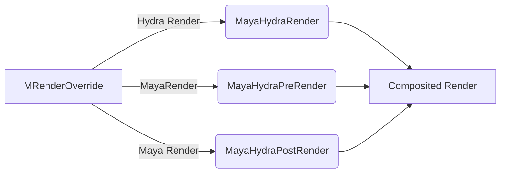
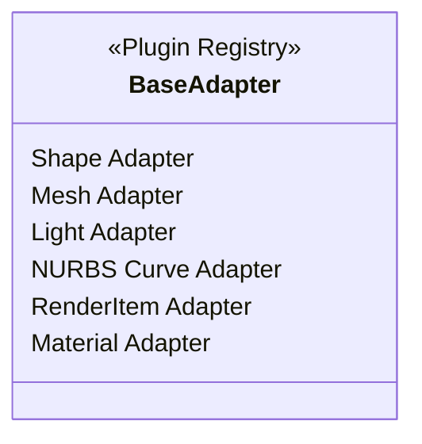
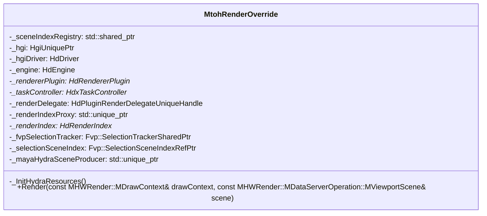
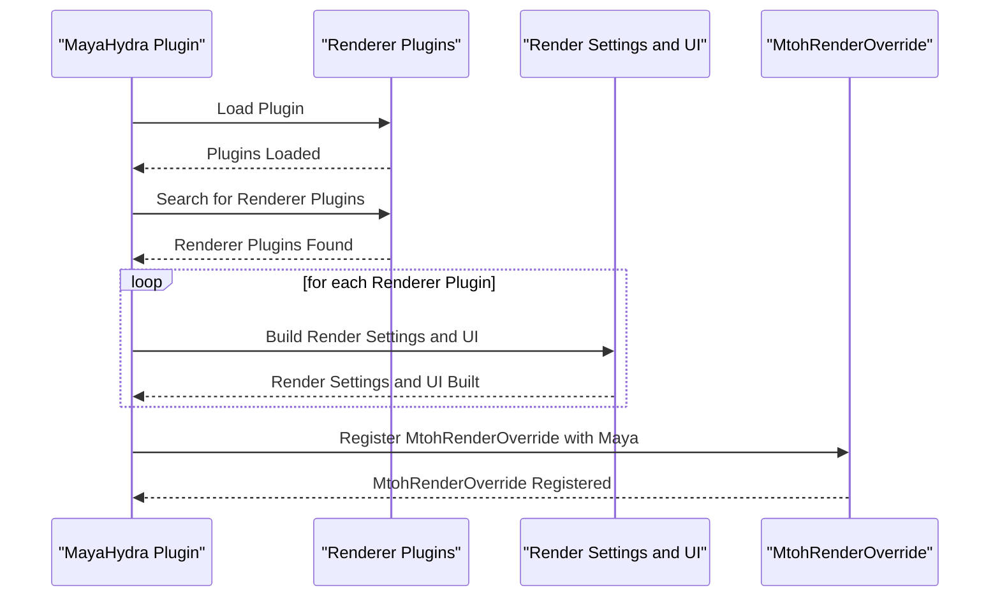
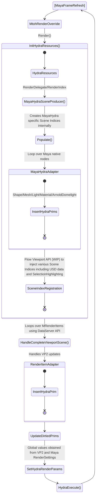

# Introduction to MayaHydra

The _Hydra for Maya_ project builds on the foundation of the Maya to Hydra (MtoH) plugin, contributed by Luma Pictures.  Our goal is to extend this plugin to cover a wider array of use cases, prioritizing performance, robustness, and customizability.

The MayaHydra code is a Maya plugin using the MRenderOverride API. This API binds the plugin to a Maya viewport window, adds an entry in the Renderer menu to activate the plugin, and allows control of overall viewport rendering.

### Maya API Additions

We have begun adding new APIs to Maya to provide efficient access to renderable viewport data.  The experimental MDataServerOperation(Maya 2024 onwards) gives an MRenderOverride plugin like MayaHydra access to Viewport 2.0's internal copy of renderable scene data.  MayaHydra can use this as an option to render data provided by Viewport 2.0, instead of having to reconstruct internal Maya features to match viewport appearance and the behavior of Maya features.

### Change Notifications

The MDataServerOperation API provides change notifications that better match the requirements of a viewport.  Without this API, a plugin depends on individual attribute change callback notices, something that scales poorly with large scenes.  Instead of these low-level, fine-grained change notices the MayaHydra plugin can leverage the internal change notification system used by vp2.  This system boils down different attributes into simpler categories that better align with Hydra HdDirtyBits.  This internal change notification system is efficiently and thread-safely integrated with the Maya Evaluation Manager and the EM Caching system.


### Hybrid Viewport Rendering 
MRenderOverride API allows a plugin interface to execute Hydra rendering from within Maya's viewport model. The MDataServerOperation is stacked with Maya native pre and post scene render passes. The pre and post scene render is controlled by Maya which does the rendering of elements like HUDs, GreasePencils and Manipulators. However, rendering of these elements could be delegated to Hydra in the future.



### Color Management(CM)
Maya's Color Managment is applied to all applicable viewports including viewport overrides. MayaHydra plugin override inherits this behavior. So the final frame rendered out from Hydra undergoes Maya's CM. All workflows pertaining to CM within Maya remain the same so user can configure CM with MayaHydra as they would for a VP2 viewport. 

Hydra also support CM internally via Hydra Tasks. In the current version of the plugin, Hydra's CM is not applied. There are a couple of blockers for this to implemented at the moment(5th Oct 2023). USD is on OCIO v1 and Maya uses OCIO v2. There are some incompatibities with these two version and can lead to unpredictable behaviour.

### Data Access and Interpretation

Maya contains many different object types and features that affect how they render.  To try to replicate that rendering, a plugin viewport would have to access the raw data of each object through node attributes and to reimplement the display logic. This makes supporting a wide range of object types and features too costly.

Instead of always extracting state from the raw attributes of a Maya node, the MDataServerOperation API provides an abstract view of things to be rendered via the (pre-existing) MRenderItem API.  A render item is similar to a Hydra RPrim and roughly corresponds to a single traditional 3D "draw call" in OpenGL or DirectX. It is an association of geometry buffers with an index buffer, a primitive type (triangles, lines, points), a shader, and shader parameters (transform matrices, colors, textures, etc.)  The MRenderItem wraps an internal renderable object that VP2 uses internally to draw.

One effect of the MRenderItem approach is that the plugin viewport no longer needs to care about the details of most Maya node types.  For something like a Maya joint node, the original attribute approach involved writing an adapter class that manages all the attributes for the type and its interactions with other DAG objects.  In the MRenderItem approach, the plugin doesn't necessarily need any joint-specific code.  Instead, it receives an MRenderItem with the line geometry and color information, which is enough to render and support selection.  In this way, we leverage the existing Maya viewport code that implements the "business logic" that decides what a joint looks like, while delegating rendering control to the Hydra framework.  Here the Maya internal viewport code functions as a data source, serving primitives to Hydra.

### MRenderItem Method Can be Optional

The MRenderItem approach might not make sense in all circumstances, and can be optional.  The lead case is that mesh geometry buffers might work better using the MFnMesh interface. This is the approach the original MtoH code used. The reason is that the default geometry format that the Maya viewport translation code produces has been triangulated and re-indexed so that all geometry streams share a single index buffer.  But Hydra, and especially Storm, prefer untriangulated face data.  For the simple default case of drawing a mesh, possibly with its full wireframe displayed (and nothing else), the value of the render item system is unclear.  We can bypass the render items and provide raw face data using the MFnMesh extraction method from the original MtoH class HdMayaMeshAdapter, skipping normal buffer generation and re-indexing.  This option is likely to be simpler and more efficient in the default case for meshes.  When MRenderItems are needed for meshes using extra display modes, we can combine those approaches.  We expect animation workflows to fit better with the raw face data approach and modelling workflows to require the MRenderItem approach.  This requires more experimentation to validate these assumptions.

We have the flexibility needed to handle other object types outside the MRenderItem system.  This can also be a customization point for other custom sources of data.

### Adapters for direct translation of Maya data to Hydra

MayaHydra utilizes USD's PluginRegistry mechanism to translate Maya native data to Hydra. Maya meshes/shapes, camera, lights(spot,area, directional), NURBS Curves, materials and, as a special case, Arnold's SkyDomeLight are handled by these adapaters. MRenderItem described above is also handled by this plugin registry adapter mechanism.


### Optional Adapter to Maya meshes

It was mentioned earlier that the MRenderItem usage is optional. MayaHydra can be told to use native Maya mesh data instead of MRenderItem by setting the environment variable ```MAYA_HYDRA_USE_MESH_ADAPTER``` to 1. 

### Integration with MayaUSD and Other Maya Plugin Nodes Using Scene Indices

The maya-usd plugin provides access to USD data files inside Maya by injecting that data into Maya, for Viewport 2.0 to render.  It extracts that data from USD and tweaks it for compatibility with Maya features via a custom Hydra render delegate.  This method doesn't work when the aim is to draw with Hydra Storm or a different render delegate, so we are exploring new methods to integrate MayaHydra with MayaUSD.  MayaUSD continues to facilitate the USD data source (through the MayaUsdProxyShape Maya node) and the editing of that data.  MayaHydra controls the rendering of that data.

Experimentally, we have separated the two plugins so that they no longer link together.  We use USD's HdSceneIndexPluginRegistry interface to query for a registered HdSceneIndex provider for a Maya node, using a naming convention based on the node type name.  Our hope is that this can also be the entry point for third-party plugins to control the viewport rendering of custom node types (MPxLocatorNode or MPxSurfaceShape) purely through the Hydra API instead of through Maya's various viewport APIs.  This could potentially replace the Maya APIs MPxSubsceneOverride, MPxDrawOverride, and MPxGeometryOverride.  

### Scene Delegate vs Scene Index
MayaHydra's long term plan is to migrate to using Scene Index completely and remove dependency on SceneDelegates. This aligns with the Pixar's recommendation as Hydra will eventually deprecate Scene Delegate support. During this transition phase, we are supporting both Scene Delegate and Scene Indices. By default, Scene Index is used but it can be overridden to use Scene Delegate using the environment variable ```MAYA_HYDRA_ENABLE_NATIVE_SCENE_INDEX``` to 0. Please note that Scene Delegate mode will not be actively supported and the Scene Index mode is the recommended one.

### Plugin initialization, render loop and data flow through the plugin.
As described in the section above, the plugin hooks into Maya Viewport through the MRenderOverride API. 

A class diagram with some of the key members looks something like this. For sake of brevity only a few members are listed. Please refer to accompanying code for details. 

The class is contains resources pertaining to both Maya and Hydra. 

We will do a high-level walk through of various execution phases, render loop and corresponding data flow. Please note the plugin is undergoing major design changes with newer APIs being introduced. The diagrams below are relevant as of 5th October 2023. 

### Plugin Load

### The Render Loop
