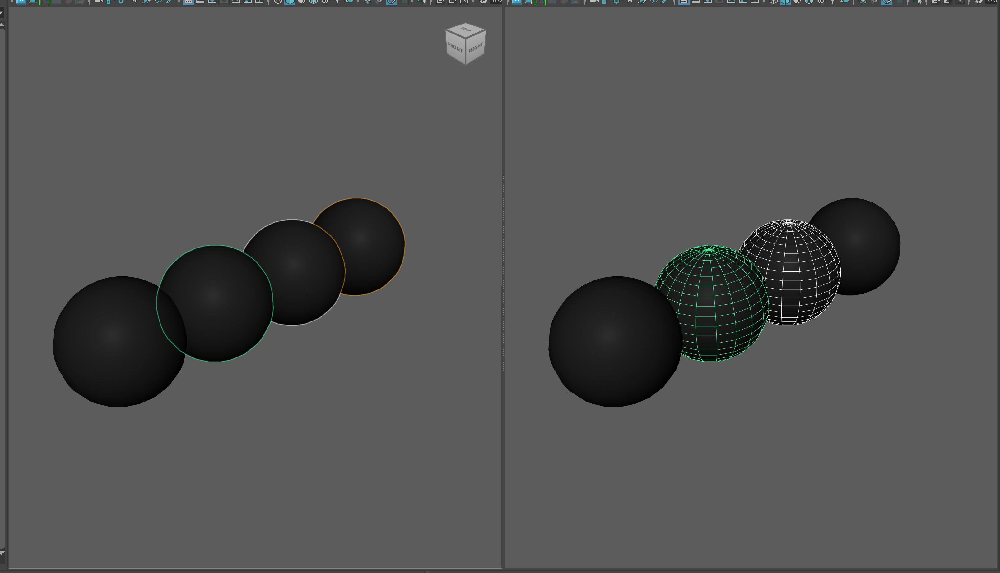
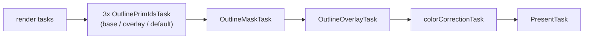

# Outline Selection Highlighting Architecture

[selectionHighlightingArchitecture.md](selectionHighlightingArchitecture.md) describes the
**added geometry** selection highlighting style — a wireframe drawn on top of selected objects —
and notes that the other style, **pixel-based modified object appearance**, "is handled by having
a plugin provide a selection highlighting task to the Flow Viewport Toolkit". This document
describes that second style, as implemented for the Hydra Storm render delegate using the Hydra
Viewport Toolbox (HVT) outline tasks.

This document describes the state of outline selection highlighting as of 13-Aug-2026.

## Behavior

In Outline mode, a selected object is highlighted by a coloured contour drawn around its visible
silhouette in screen space, instead of by a wireframe added to the scene.

The lead object — the most recently selected one — gets its own colour, as it does with wireframe
highlighting. An optional hover highlight outlines the object under the cursor in a third colour.



The two styles are mostly mutually exclusive per viewport: whichever mechanism is in charge, the
other is suppressed for the common case, and most of the complexity described below is in that
suppression rather than in the outline itself. It isn't absolute, though: wireframe-on-shaded
deliberately shows both cues (see Limitations), and a few edge cases documented later
(an unrecognized render item, a component-mode selection) fall back to leaving VP2's wireframe cue
alone rather than risk hiding geometry, so a double highlight is possible there too.

## Choosing the mechanism

The mode is a render global, `mayaHydraSelectionHighlightMode`, an enum whose values are
*Outline Selection* and *Legacy Selection*, created in
[`renderGlobals.cpp`](../lib/mayaHydra/mayaPlugin/renderGlobals.cpp) and exposed in the renderer's
option box.

`MtohRenderOverride::_UseOutlineSelectionHighlighting()` is the single predicate the rest of the
code asks, and it is **not** the same thing as the render global:

```cpp
return _isUsingHdSt && _globals.outlineSelectionHighlight;
```

- **Storm only.** HVT's outline tasks need a rasterizer to render prim IDs, Storm-specific render
  buffers and a GL compute shader for the mask, and gate themselves on Storm internally. A
  non-Storm delegate therefore keeps the legacy wireframe highlighting, whatever the global says.
- **Not offered on USD 24.11**, where HgiGL corrupts the non-zero integer prim IDs the outline mask
  shader samples, **nor on macOS**, where outline selection highlighting is unsupported. In those
  configurations the enum lists *Legacy Selection* only, and it is the default.

Switching mode changes the scene index chain, so it cannot be done in place: `UpdateRenderGlobals()`
flags `_needsClear`, and `Render()` runs `ClearHydraResources()` / `_InitHydraResources()` and then
issues `ogs -reset`. The reset is required because the rebuild drops every VP2 render item adapter,
and Maya's data server only re-sends *changed* render items — without it, unchanged native objects
would disappear.

## The HVT outline pipeline

The outline itself lives in HVT, not in this repository. `HVT_NS::Outline::OutlineManager` is a
feature-level wrapper over five tasks — three `OutlinePrimIdsTask` passes (base / overlay /
default), an `OutlineMaskTask` and an `OutlineOverlayTask` — and owns their task IDs, AOV bindings
and internal ordering. The prim-ID passes rasterize the paths they are given into an ID texture; the
mask pass classifies edges in that texture with a compute shader and colours them; the overlay pass
composites the result.

See [`hvt/tasks/outline/outlineManager.h`](../lib/hydra-viewport-toolbox/include/hvt/tasks/outline/outlineManager.h)
and [HVT's outline documentation](../lib/hydra-viewport-toolbox/docs/outline.md) for the pipeline
itself. What matters here is the host side of the contract.

State is **push-based**. The host calls `SetStyle()` with an `OutlineStyle` (the colours plus edge
softness, blur and the `enableDefaultOutlines` switch) and `SetInputs()` with an `OutlineInputs`,
whose path buckets are:

| Bucket | Meaning | What maya-hydra puts there |
|---|---|---|
| `selectedPaths` | rasterized into the base prim-ID texture | `Fvp::Selection::GetFullySelectedPaths()` |
| `leadPath` | recolours whichever of its prim IDs are already in the base texture | `MhLeadObjectPathTracker::getLeadObjectPrimSelections().front()` |
| `hoverPaths` | hover candidates, merged into the base texture | the prim resolved under the cursor |
| `overlayPaths` | independent layer, e.g. manipulators | unused |
| `excludePaths` | removed from the **default** (whole-scene) bucket only | `_highlightHierarchyPrefix` |

`isHoverSelected` tells the mask shader that the hovered prim is already selected, so it can use the
selected-hover colour rather than the unselected-hover one.

### Where it is installed

The manager is installed on **frame pass 0** in `_InitHydraResources()`, and only when
`_UseOutlineSelectionHighlighting()` is true:

```cpp
_outline->Install(*outlinePass, ccPath, hvt::TaskManager::InsertionOrder::insertBefore);
```

Pass 0 is the main Storm pass, and is the only candidate: its render index holds all scene geometry,
which the prim-ID tasks must be able to see. Pass 1, the secondary graphics pass, holds secondary
graphics prims (wireframe highlights, bounding boxes, light and camera gizmos, NURBS curves,
viewport decorations) and cannot render prim IDs for USD prims.

`ccPath` is the pass's `colorCorrectionTask`, and the insertion is `insertBefore` so the outline
executes and composites before `PresentTask`. Appending at the end would place the outline tasks
*after* the present, drawing into a buffer that has already been blitted to screen and is cleared at
the start of the next frame.



### Two load-bearing HVT contracts

- **The manager is render-thread-only.** `Install()`, `SetInputs()` and `SetStyle()` are not
  internally synchronized and must be called from the thread that drives the frame pass commit.
  This is why the observers (`SelectionChanged()`, `ColorPreferencesChanged()`, the hover event
  filter) only ever set `std::atomic<bool>` dirty flags — declared together in
  [`renderOverride.h`](../lib/mayaHydra/mayaPlugin/renderOverride.h) — and every call into the
  manager is made from `Render()`. Each flag is tested against `outlineLive` before its `exchange()`,
  so a change made while no outline exists stays pending rather than being swallowed.
- **The frame pass must outlive the manager**, which caches a pointer to it. `ClearHydraResources()`
  therefore does `_outline.reset()` *ahead of* the frame pass teardown. The order is load-bearing
  and carries a comment saying so.

## Disabling the added-geometry highlight

An object should not normally be highlighted twice, so when the outline owns the highlight the
wireframe highlight has to stop in the common case (see Behavior for the exceptions). USD prims and
Maya-native prims need completely different treatment, because the wireframe highlight is produced
in a different place for each.

| | USD prims | Maya-native prims |
|---|---|---|
| Who draws the wireframe highlight | we do, in the scene index chain | VP2 / OGS, before Hydra sees the data |
| How it is disabled | the highlighting scene indices are not created | the render item is skipped, or translated and hidden |
| Where | `_CreateSceneIndicesChainAfterMergingSceneIndex()` | `MayaHydraSceneIndex::UpdateRenderItems()` |

### USD prims: do not build the highlighting scene indices

The `Fvp::*WhSi` filtering scene indices
([`lib/flowViewport/sceneIndex/wireframeHighlights/`](../lib/flowViewport/sceneIndex/wireframeHighlights/))
inject an `overrideWireframeColor` primvar and a wireframe repr onto selected prims and their
descendants. Since we create them, disabling them is a matter of not creating them:

```cpp
// lib/mayaHydra/mayaPlugin/renderOverride.cpp
// These are only used when the pixel outline is not the highlight mechanism.
if (!_UseOutlineSelectionHighlighting()) {
    ... _geomSubsetWhSi / _meshWhSi / _niInstanceWhSi / _niPrototypeWhSi
        / _piInstancerWhSi / _piPrototypeWhSi ...
}
```

`ClearHydraResources()` resets those `RefPtr`s so a mode switch does not leave stale ones behind
across the clear-and-reinit cycle.

### Maya-native prims: VP2 already drew it

For Maya-native data the highlight is not ours. When a shape is selected, VP2 makes that shape's
persistent wireframe render item visible and already coloured in the selection colour, and there is
no API to ask it not to. By the time the item reaches
[`mayaHydraSceneIndex.cpp`](../lib/mayaHydra/hydraExtensions/sceneIndex/mayaHydraSceneIndex.cpp) it
is an ordinary `MRenderItem` in the `MViewportScene` snapshot, indistinguishable from real geometry
except by inspection.

Suppression is therefore downstream, in the translator. `isWireframeItemReplacedByOutline()` decides
whether a given render item is a selection highlight that the outline replaces:

1. **The item is identified by name**, from a deliberately short allowlist:

   ```cpp
   constexpr std::array<std::string_view, 2> kSelectionHighlightWireNames = {
       "DormantPolyWire",     // polygon mesh
       "DormantIsoparmWire"   // NURBS surface
   };
   ```

   Not by category or draw mode. Every line item VP2 sends for a shape is a `DecorationItem`, and
   once the shape is selected they all carry the same `drawMode`, so a category match also caught
   bounding boxes, NURBS hulls, NURBS origin curves and the smooth-mesh preview cage, and made them
   disappear. The name is also stable in a way the cached primitive type is not: the adapter records
   `_primitive` once at construction while VP2 reuses an item after changing it.

   The allowlist is not exhaustive on purpose. An unrecognized item is left alone, which means at
   worst a double highlight rather than missing geometry.

2. **The shape must actually be selected**: `MGeometryUtilities::displayStatus()` is `kActive` *or*
   `kLead` — both are needed, because a single selected object reports `kLead` rather than `kActive`.
   Component statuses such as `kHilite` are excluded: that wire is component feedback, which the
   outline does not replace. The status is queried on the shape, resolving a transform through
   `extendToShape()` rather than rejecting the item, since an unrecognized item keeps VP2's selection
   colour and double-highlights.

3. **The viewport must draw no wireframes of its own.** `viewportDrawsWireframes()` in
   [`renderOverride.cpp`](../lib/mayaHydra/mayaPlugin/renderOverride.cpp) tests
   `kWireFrame | kShadeActiveOnly` — the latter counts because it shades only the active object, so
   unselected ones are wireframe whether or not Maya also sets `kWireFrame`. Whenever the viewport
   draws wireframes the wire is kept: in wireframe-on-shaded it is real geometry the user asked for,
   and both cues are shown.

When all three hold, the wire is dropped by one of two routes:

- **Never translated yet → skip it entirely**, before adapter construction. Storm syncs invisible
  rprims: `HdStBasisCurves::Sync` calls `_UpdateVisibility` and then proceeds to `_UpdateRepr`
  unconditionally, with visibility only consumed much later at draw-item-instance level. So hiding
  an rprim still pays the vertex buffer copy, the full index-buffer scan for `maxIndex`, the topology
  build and a GPU upload for something that is never drawn. VP2 creates that wire only for *selected*
  shapes, so the cost is bounded by selection size — except at import, where Maya leaves everything
  selected, and it becomes whole-scene cost at the heaviest moment.
- **Already translated → hide it through the adapter.**
  `MayaHydraRenderItemAdapter::SetWireframeSelectionHighlightEnabled(false)` makes `GetVisible()`
  return false and dirties visibility. Dropping and re-adding the prim on every selection change
  would cost more than keeping it hidden. The call is made *after* `UpdateFromDelta()`, so a
  visibility change arriving from VP2 in the same delta cannot overwrite it.

The wire is **never recoloured**. An earlier design recoloured it to its dormant colour so the
outline could be the only cue in wireframe-on-shaded; that was removed, because there is no reliable
source for a per-object dormant colour. `displayRGBColor -list` confirms Maya exposes dormant RGB
preferences for polygon meshes only (`polymeshDormant` / `polymeshActive` / `lead` /
`templateDormant`); NURBS and subdiv shapes take their dormant colour from the *indexed* palette via
the object's colour index, so there is no correct value to substitute. The rule is now simply: hide,
or leave exactly as VP2 sent it.

### Recovering a wire that was skipped or hidden

`UpdateRenderItems()` can only act on what Maya sends, and Maya does not re-send unchanged render
items when the display style changes. So a switch from shaded into wireframe-on-shaded — where a
suppressed wire becomes needed again — needs two mechanisms, both driven from `Render()` and both
gated on the display-style bits that actually affect the treatment (`kWireFrame`, `kGouraudShaded`,
`kTextured`, `kFlatShaded`, `kShadeActiveOnly`; toggling X-ray or backface culling changes the
display style without changing whether wireframes are drawn):

- **Already-translated items**: `RefreshRenderItemLegacyHighlightTreatment()` walks the render item
  adapters and re-evaluates the predicate for each, using the name and DAG path the adapter retains.
- **Skipped items** are not represented in the adapter map at all, so they cannot be walked. Instead,
  `RenderItemUpdateOptions::reconsiderSkippedHighlightWires` makes the next `UpdateRenderItems()`
  look at items Maya flagged as unchanged, which it normally skips on `flags == 0`. This works
  because `MViewportScene` is a **full snapshot every frame** — the skipped wire is present with
  `flags == 0x0000` on every idle frame, so the `MRenderItem` is always reachable and Maya never has
  to be forced to re-send it. Because Maya sent no visibility bits for such an item, the flags are
  synthesized from `MRenderItem::isEnabled()` before `UpdateFromDelta()`, which would otherwise
  leave the new adapter at its default of invisible.

  Recovery only runs on the *not drawing wireframes → drawing wireframes* transition, the one
  transition that turns a skipped wire back into one that must be drawn. Going the other way can only
  hide more; a deselection arrives as an ordinary render item delta; and a highlight mode switch
  re-sends everything via `ogs -reset`.

### `excludePaths`

`OutlineInputs::excludePaths` is set to `_highlightHierarchyPrefix`
(`/FlowViewportSelectionHighlights`) so that the whole-scene default outline bucket does not outline
the highlight prims themselves. Only that prefix is excluded: `excludePaths` affects the default
bucket alone, so excluding `MAYA_NATIVE_ROOT` here would leave `enableDefaultOutlines` covering USD
prims only.

## Hover highlighting

Hover outlines the object under the cursor. It is a separate render global,
`mayaHydraOutlineHoverHighlighting`, **off by default**: every mouse move forces a full frame, which
is not something to impose on a heavy scene. It is only ever active when the outline owns the
highlight, since the outline is what draws it.

The chain is:

1. **Mouse source.** `MayaHydra::HoverEventFilter`
   ([`hoverEventFilter.h`](../lib/mayaHydra/mayaPlugin/hoverEventFilter.h)) is a passive Qt event
   filter installed on the model panel's viewport widget. It never consumes events, so Maya's own
   interaction is unaffected, and it enables mouse tracking so moves arrive with no button held. It
   reports device pixels and flips Qt's top-left origin to Maya's bottom-left against the widget's
   own height.

   This is the one part of the feature that is conditionally compiled: `Qt6` is found only when the
   Maya devkit ships it, so `hoverEventFilter.cpp` and every use of it are guarded by
   `MAYAHYDRA_HAS_QT`. Without Qt everything else works, minus hover.

2. **Per-panel state.** The filter's callback writes into a `HoverState` — cursor position, whether
   the cursor is inside with no button held, and a dirty flag — and schedules a refresh. State is
   keyed by panel name because one `MtohRenderOverride` serves every viewport using that renderer,
   as do `_outline` and the frame passes. A single shared state would highlight every viewport at
   once. The fields are individually atomic rather than snapshot-consistent: a frame can pair an `x`
   from before a mouse move with a `y` from after, which is one frame of one pixel.

3. **Resolution.** `_ResolveHoverPath()` runs a 1×1 `HdxPickTask` at the cursor pixel through the
   outline frame pass and returns the prim path, or an empty path over background. The result goes
   into `hoverPaths`, so the prim is outlined across its whole visible silhouette, exactly like a
   selection -- including staying visible through any unselected object in front of it.

4. **Staying correct when the view moves.** A stationary cursor ends up over a different prim when
   the view moves — playback, an animated or scripted camera, a resize — with no mouse event to
   signal it. `Render()` therefore compares the view-projection matrix against the one recorded for
   that panel on the last hover resolution, and dirties the hover when it differs. Only while
   genuinely hovering, so a non-hovering viewport pays nothing.

Because one `OutlineManager` is shared by every panel, the manager holds whatever the last panel
pushed. While hover is enabled, each panel therefore pushes its inputs *every* frame rather than
relying on the dirty flag, or it would draw the previous panel's hover. The dirty-flag optimisation
stays valid for the selection-only case, since the selection is global and every panel wants the same
paths.

`_RemovePanel()` uninstalls the filter and clears the state *before* any teardown, so a queued mouse
move cannot push hover inputs into a half-removed scene index chain.

## Colours

`_BuildOutlineStyle()` starts from a set of fallback colours and then overrides the two with a clear
Maya preference equivalent: `wireframeSelectionSecondary` for `selectedColor` and
`wireframeSelection` for `selectionLeadColor`. A preference replaces a colour in full, alpha
included, so the outline shows exactly what the user configured.

A colour preference change is delivered by `MtohRenderOverride::ColorPreferencesChanged()`, which
only sets flags; the work happens on the next `Render()`. That deferral is required, not incidental:
`MayaColorPreferencesTranslator` notifies *before* storing the new value, so a colour read during the
notification still returns the old one.

On the next frame `Render()` then:

- rebuilds and pushes the outline style, and
- refreshes `MhWireframeColorInterfaceImp`'s cached legacy wireframe colours via `RefreshColors()`
  and dirties from the root, so dormant and selection colours both repaint at once instead of waiting
  for the next selection change. Those colours are cached because they are queried once per prim
  whose `displayColor` is re-evaluated, which on a large selection change is a lot of queries.

### Invalidating selection colours

A prim's wireframe colour is pulled once and only re-pulled when the prim is dirtied, and nothing
else dirties prims on a selection change. `MhDirtySelectionColorsSceneIndex`
([`mhDirtySelectionColorsSceneIndex.h`](../lib/mayaHydra/hydraExtensions/sceneIndex/mhDirtySelectionColorsSceneIndex.h),
renamed from `MhDirtyLeadObjectSceneIndex` when its responsibility widened) does that, with two entry
points: `dirtyLeadObjectRelatedSelections()` for a change of *which* object is the lead, and
`dirtySelectionRelatedPrims()` for a change of *what* is selected.

This matters in both highlight modes, and it matters more in Outline mode. With wireframe
highlighting the `*WhSi` scene indices *add* highlight prims, which fetch fresh colours, so the
highlight never depends on the base prim's `displayColor`. In Outline mode those scene indices are
not installed, so the base prim's own wireframe becomes what the user sees, and a stale colour is
visible in more display styles.

`Render()` computes the set of prims to dirty as a `std::set_symmetric_difference` between the
current fully-selected paths and `_previouslySelectedPaths`, rather than dirtying the whole
selection. Dirtying a path walks its entire subtree, and a prim that stayed selected cannot have
changed colour — so adding one object to a large selection would otherwise re-walk all of it. The
invalidation is done from `Render()` rather than from `SelectionChanged()` for two reasons: the Fvp
selection is guaranteed to have been updated by then, and scene index mutation belongs on the render
thread.

## Limitations

- **Storm only.** Other render delegates keep the legacy wireframe highlighting. Supporting a
  non-rasterizing delegate would mean a separate Storm pass rasterizing selected geometry alongside
  the beauty render and compositing the two — an HVT project, not a flag.
- **Not available on USD 24.11**, where HgiGL corrupts the prim IDs the mask compute shader samples,
  **or on macOS**, where outline selection highlighting is unsupported.
- **Wireframe-on-shaded shows both cues.** Deliberate: the alternative was recolouring VP2's wire,
  and there is no correct dormant colour to recolour it to for non-mesh shapes.
- **`enableDefaultOutlines` is off by default.** This is an HVT outline feature — a faint outline on
  every prim in the scene, which shows internal edges — not a diagnostic. It is off because its
  whole-scene prim-ID pass runs every frame and its cost scales with the scene rather than with the
  selection. It remains reachable through the `mayaHydraEnableDefaultOutlines` render global, by
  command, and is deliberately absent from the option box.
- **`_oldDisplayStyle` is per-override, not per-panel.** With several panels in different display
  styles, the highlight treatment tracks whichever panel rendered last. This converges rather than
  churning, because skipping only ever applies to items that were never translated and nothing is
  removed: an item translated once stays translated.
- **Component statuses are not treated as selected.** `kActiveTemplate`, `kActiveComponent` and
  `kActiveAffected` all fall through to "keep the wire", the safe direction. An object selected and
  then put into component mode may show both the outline and its VP2 wire.
- **Non-default render tags/purposes are never sampled.** Neither `OutlinePrimIdsTask` nor
  `OutlineManager` overrides `GetRenderTags()`, so both fall back to `HdxTask`'s default, which only
  covers the standard "geometry" tag. A selected object rendered with a different purpose — e.g. left
  in `secondaryGraphics` purpose — is invisible to the outline's prim-ID sampling and never gets an
  outline cue, regardless of selection. This is a gap in the `hydra-viewport-toolbox` submodule, not
  in this repository.
