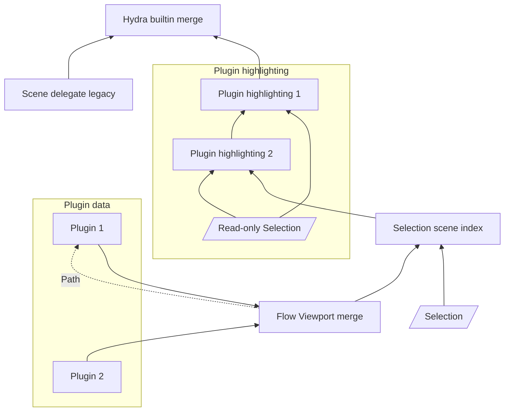
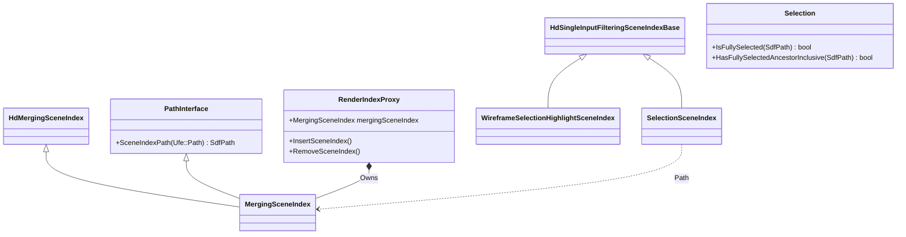

# Selection Highlighting Architecture

Selection highlighting changes the in-viewport appearance of selected objects
or object components.

In the following document we will refer to the software infrastructure that
supports Hydra rendering in this repository as the Flow Viewport library (name
subject to change).

This document will describe the state of Flow Viewport library selection
highlighting as of 21-Sep-2023.

## Behavior

Applications maintain a set of selected objects that the user can add to and
remove from.  Selected objects are usually the target of user operations, and
are shown differently in the viewport for ease of understanding.

An application will provide a way to select an object, or to select components
of an object.  For example, for a mesh object, these components may be points,
edges, or faces.  At time of writing, only object selection highlighting is
supported, and selection highlighting of components is unimplemented.

## Selection: Application versus Hydra

The application maintains an edit-friendly version of the scene.  This scene is
translated into a Hydra scene by scene indices.  Correspondingly, there are two
versions of the selection, one in the application, with objects and their paths
described with application-specific classes, and a version of the selection in
the Hydra scene, described as prims and their `SdfPath`s

## Requirements

Requirements for selection highlighting are:

- It must be possible to provide selection highlighting in an application that
  supports multiple data models (e.g. Maya data and USD data), and plugins to
  those data models (e.g. Maya plugin nodes).

- Selected prims in the Hydra scene index tree must contain a data source
  indicating their selection state.  This data source is the one used by Pixar
  in Hydra code, and thus is used in usdview.

- Data injecting plugin scene indices must be able to specify their selection
  highlight appearance.

- It must be possible to let a data injecting data model provide prims to Hydra
  that already contain selection highlighting.  At time of writing
  (19-Sep-2023), this is true of Maya native Dag data, where selection
  highlighting is done by OGS.

## Selection Highlighting Styles

There are at least two approaches to selection highlighting:
- **Added geometry**: adding secondary geometry that indicates the selected
status of objects in the scene, e.g. wireframe or bounding box.
- **Pixed-based modified object appearance**: rendering selected objects in a
special way, e.g. object contour, modified object color, or object overlay.

The former approach is handled by having a plugin provide a selection
highlighting filtering scene index to the Flow Viewport library, and is the
topic of this document at time of writing (20-Sep-2023).  The
latter is handled by having a plugin provide a selection highlighting 
task to the Flow Viewport library, and is currently unimplemented.

## Added Geometry Plugin Software Architecture Requirements

A selection highlighting plugin that provides added geometry to scene must
provide the following services:

- A way to translate the application's selection path(s) into Hydra paths:
    - So that the appropriate prims in Hydra can be dirtied on selection change.
    - So that selected prims in Hydra can have a data source added.
  This is embodied in a **Path interface**.

- A way for the plugin to query the Hydra version of the application
  selection:
    - So that the plugin can add the appropriate selection highlighting
      geometry on those prims that require it, e.g. a different color for the
      first selected object, or selection highlighting for a complete hierarchy.

## Sample Code
### Selection Change

The following selection change code shows the use of the *Path Interface*,
through the *SceneIndexPath()* method, called on the input scene index.  The
path interface allows the selection scene index to translate selected
application paths to selected Hydra scene index paths.
```
void
SelectionSceneIndex::AddSelection(const Ufe::Path& appPath)
{
    TF_DEBUG(FVP_SELECTION_SCENE_INDEX)
        .Msg("SelectionSceneIndex::AddSelection(const Ufe::Path& %s) called.\n", Ufe::PathString::string(appPath).c_str());

    HdSelectionSchema::Builder selectionBuilder;
    selectionBuilder.SetFullySelected(
        HdRetainedTypedSampledDataSource<bool>::New(true));

    // Call our input scene index to convert the application path to a scene
    // index path.
    auto sceneIndexPath = _inputSceneIndexPathInterface->SceneIndexPath(appPath);

    TF_DEBUG(FVP_SELECTION_SCENE_INDEX)
        .Msg("    Adding %s to the Hydra selection.\n", sceneIndexPath.GetText());

    _selection->pathToState[sceneIndexPath].selectionSources.push_back(
        selectionBuilder.Build());

    _SendPrimsDirtied({{sceneIndexPath, locators}});
}
```

### Wireframe Selection Highlighting

The following wireframe selection highlighting code shows the use of the
*Selection*, through the *HasFullySelectedAncestorInclusive()*
method, called on the input selection.  The selection allows a
selection highlighting filtering scene index to query selected prims.
```
bool WireframeSelectionHighlightSceneIndex::HasFullySelectedAncestorInclusive(const SdfPath& primPath) const
{
    return _selection->HasFullySelectedAncestorInclusive(primPath);
}

HdSceneIndexPrim
WireframeSelectionHighlightSceneIndex::GetPrim(const SdfPath &primPath) const
{
    TF_DEBUG(FVP_WIREFRAME_SELECTION_HIGHLIGHT_SCENE_INDEX)
        .Msg("WireframeSelectionHighlightSceneIndex::GetPrim(%s) called.\n", primPath.GetText());

    auto prim = _GetInputSceneIndex()->GetPrim(primPath);

    // If this isn't one of our prims, we're not responsible for providing a
    // selection highlight for it.
    if (primPath.HasPrefix(_sceneRoot) && 
        prim.primType == HdPrimTypeTokens->mesh) {
        prim.dataSource = HdOverlayContainerDataSource::New(
            { prim.dataSource, HasFullySelectedAncestorInclusive(primPath) ? 
                sSelectedDisplayStyleDataSource : 
                sUnselectedDisplayStyleDataSource });
    }
    return prim;

}

void
WireframeSelectionHighlightSceneIndex::_PrimsDirtied(
    const HdSceneIndexBase &sender,
    const HdSceneIndexObserver::DirtiedPrimEntries &entries)
{
    TF_DEBUG(FVP_WIREFRAME_SELECTION_HIGHLIGHT_SCENE_INDEX)
        .Msg("WireframeSelectionHighlightSceneIndex::_PrimsDirtied() called.\n");

    HdSceneIndexObserver::DirtiedPrimEntries highlightEntries;
    for (const auto& entry : entries) {
        // If the dirtied prim isn't one of ours, we're not responsible for
        // providing a selection highlight for it.
        if (entry.primPath.HasPrefix(_sceneRoot) && 
            entry.dirtyLocators.Contains(
                HdSelectionsSchema::GetDefaultLocator())) {
            TF_DEBUG(FVP_WIREFRAME_SELECTION_HIGHLIGHT_SCENE_INDEX)
                .Msg("    %s selections locator dirty.\n", entry.primPath.GetText());
            // All mesh prims recursively under the selection dirty prim have a
            // dirty wireframe selection highlight.
            dirtySelectionHighlightRecursive(entry.primPath, &highlightEntries);
        }
    }

    if (!highlightEntries.empty()) {
        // Append all incoming dirty entries.
        highlightEntries.reserve(highlightEntries.size()+entries.size());
        highlightEntries.insert(
            highlightEntries.end(), entries.begin(), entries.end());
        _SendPrimsDirtied(highlightEntries);
    }
    else {
        _SendPrimsDirtied(entries);
    }
}
```

## Design Option Discussion

- **Plugins use Hydra selection, not application selection**: selection
  highlighting plugins should only deal with the Hydra view of the selection,
  not the application view.  Selected objects should be Hydra prims, and paths
  to them described as `SdfPath`.  This keeps plugins independent of any
  particular application's representation of selection.

- **Plugins access the Hydra selection through the scene index tree**: although
  the selection is conceptually a singleton, we will provide access to it for
  scene index selection highlighting plugins through the scene index tree, by
  adding a mixin interface to the plugins.  This avoids creating another object
  to maintain and encapsulate the Hydra selection, since the selection scene
  index is already performing this job.

## Implementation

### Hydra Scene and Viewport Selection Result

The resulting wireframe selection highlighting of USD data is shown here:


The resulting prim selection data source is shown here:


The resulting prim wireframe display style data source is shown here:


### Flow Viewport Library

The complete implementation of selection highlighting is done in a new library
in the maya-hydra repository.  The library is called `flowViewport`, under the
`lib` directory.  The library supports [semantic
versioning](https:/semver.org), with classes in a `Fvp` namespace.
The `Fvp` namespace actually contains the flowViewport major version.  All
flowViewport files have an `fvp` prefix.

The `mayaHydraLib` library and the `mayaHydra` plugin both directly depend on
`flowViewport`.

Having the selection highlighting code in a separate library promotes
reusability and enforces separation of concerns.

### Added Geometry Selection Highlighting Through Scene Indices

The Hydra scene index tree was chosen to implement selection highlighting
through additional geometry.  This is because a scene index can inject
additional prims into the scene, modify data sources of prims in the scene,
and dirty prims in the scene whose selection status has changed.

The scene index tree is now the following:

The plugin data and plugin highlighting subtrees are where plugins add their
scene indices.  The data scene index is required, and the highlighting scene
index is optional.

### Object Modeling

The object modeling is the following:
- **Selection**: builtin provided by the Flow Viewport library.
    - Encapsulates the Hydra selection as scene index paths.
    - Is shared by the selection scene index and all selection highlighting
      scene indices.
- **Selection scene index**: builtin provided by the Flow Viewport library.
    - Has a pointer to read and write the Hydra selection.
    - Translates the application selection to Hydra selection.
- **Flow Viewport merging scene index**: builtin provided by the Flow Viewport
  library.
    - Receives data from data provider plugin scene indices.
    - Forward path interface queries to plugin scene indices
- **Plugin data scene index**: provided by plugin.
    - Injects plugin data into Hydra
- **Plugin selection highlighting scene index**: provided by plugin.
    - Has a pointer to a read-only view of the Hydra selection.
    - Processes dirty selection notifications to dirty the appropriate prim(s)
      in plugin data, including hierarchical selection highlighting
    - Adds required geometry or data sources to implement selection
      highlighting

### New Scene Index Mixin Interface Base Class

The Flow Viewport library has a new mixin interface class:

- **Path Interface**: so that the builtin selection scene index can query
  plugins to translate selected object application paths to selected Hydra
  prim paths. The plugin provides the concrete implementation of this
  interface.

### Implementation Classes

- **Wireframe selection highlighting scene index**: 
    - Uses Hydra HdRepr to add wireframe representation to selected objects
      *and their descendants*.
    - Requires selected ancestor query from selection.
    - Dirties descendants on selection dirty.
- **Render index proxy**:
    - Provides encapsulated access to the builtin Flow Viewport merging scene
      index.
    - Other responsibilities to be determined, for future extension, possibly a
      [facade design pattern](https://en.wikipedia.org/wiki/Facade_pattern).

### Class Diagram



## Algorithmic Complexity

- At time of writing, for an n-element selection, membership lookup is O(log n)
  (map of SdfPath).  Ancestor membership lookup is O(n), as we loop through
  each selected path and inspect the selected path prefix.  This could be much
  improved (to amortized O(k), for a k-element path) through the use of a
  prefix trie, such as `Ufe::Trie`.

- At time of writing, merging scene index path lookup is O(n), for n input
  scene indices.  This could be improved by implementing a caching scheme based
  on application path, as for a given application path prefix the same
  input scene index will always provide the translation to scene index path.

## Limitations

- Little investigation of pixel-based selection highlighting capability.
    - Needs task-based approach.
    - Needs selection tracker object to make selection and data derived from
      the selection available to tasks through the task context data

- No selection highlighting across scene indices: selection state propagates
  down app scene hierarchy, so that when an ancestor is selected, a
  descendant's appearance may change.  This can mean selection state must
  propagate across scene index inputs, so that if a Maya Dag ancestor is
  selected, a USD descendant's appearance can change.  This is the same
  situation as global transformation and visibility.
