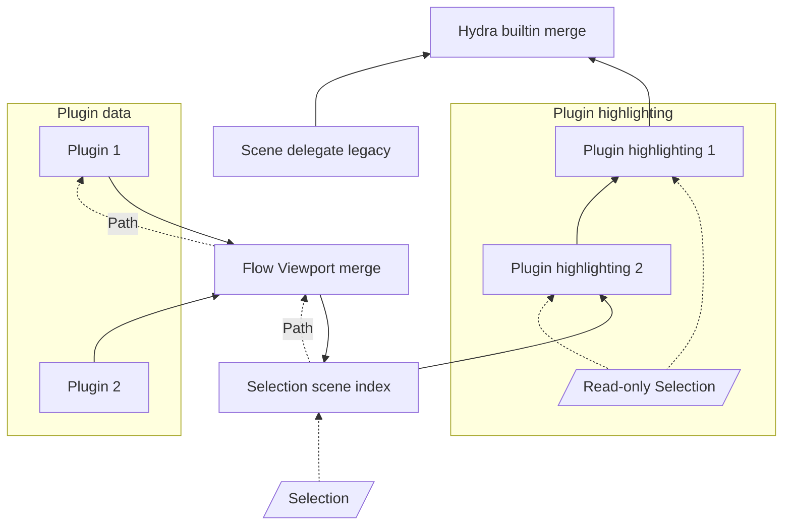
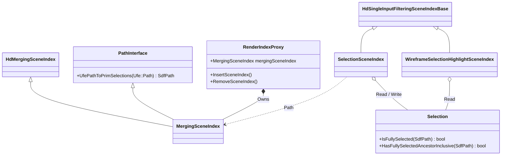
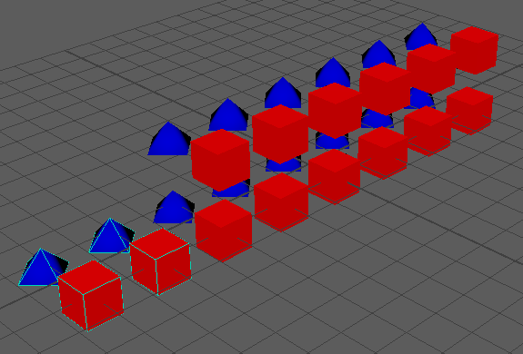
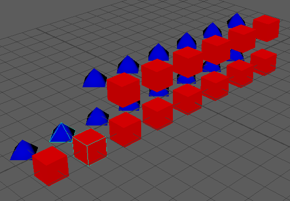
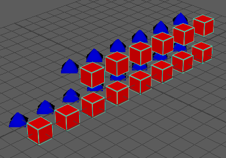
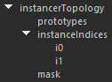
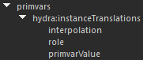
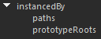
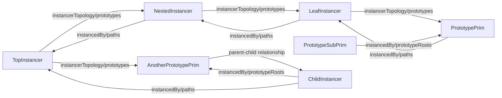

# Selection Highlighting Architecture

Selection highlighting changes the in-viewport appearance of selected objects
or object components.

In the following document we will refer to the software infrastructure that
supports Hydra rendering in this repository as the Flow Viewport Toolkit (name
subject to change).

This document will describe the state of Flow Viewport Toolkit selection
highlighting as of 31-May-2024.

## Behavior

Applications maintain a set of selected objects that the user can add to and
remove from.  Selected objects are usually the target of user operations, and
are shown differently in the viewport for ease of understanding.

An application will provide a way to select an object, or to select components
of an object.  For example, for a mesh object, these components may be points,
edges, or faces.  Currently, only object selection highlighting and point
instancing highlighting of meshes are supported.  Selection highlighting of
components is unimplemented.

## Selection: Application versus Hydra

The application maintains an edit-friendly version of the scene.  This scene is
translated into a Hydra scene by scene indices.  Correspondingly, there are two
versions of the selection, one in the application, with objects and their paths
described with application-specific classes, and a version of the selection in
the Hydra scene, described as prims and their `SdfPath`s, as well as their
associated selection data sources.

## Requirements

Requirements for selection highlighting are:

- It must be possible to provide selection highlighting in an application that
  supports multiple data models (e.g. Maya data and USD data), and plugins to
  those data models (e.g. Maya plugin nodes).

- Selected prims in the Hydra scene index tree must contain a data source
  indicating their selection state.  This data source is the one used by Pixar
  in Hydra code, and thus is used in usdview.

- Data injecting plugin scene indices must be able to specify their selection
  highlight appearance.

- It must be possible to let a data injecting data model provide prims to Hydra
  that already contain selection highlighting.  Currently,
  this is true of Maya native Dag data, where selection
  highlighting is done by OGS.

## Selection Highlighting Styles

There are at least two approaches to selection highlighting:
- **Added geometry**: adding secondary geometry that indicates the selected
status of objects in the scene, e.g. wireframe or bounding box.
- **Pixed-based modified object appearance**: rendering selected objects in a
special way, e.g. object contour, modified object color, or object overlay.

The former approach is handled by having a plugin provide a selection
highlighting filtering scene index to the Flow Viewport Toolkit, and is the
topic of this document at time of writing.  The latter is handled by having 
a plugin provide a selection highlighting task to the Flow Viewport Toolkit, 
and is currently unimplemented.

## Added Geometry Plugin Software Architecture Requirements

A selection highlighting plugin that provides added geometry to scene must
provide the following services:

- A way to translate the application's selection path(s) into Hydra paths and data sources:
    - So that the appropriate prims in Hydra can be dirtied on selection change.
    - So that selected prims in Hydra can have a data source added.
  This is embodied in a **Path interface**.

- A way for the plugin to query the Hydra version of the application
  selection:
    - So that the plugin can add the appropriate selection highlighting
      geometry on those prims that require it, e.g. a different color for the
      first selected object, or selection highlighting for a complete hierarchy.

## Sample Code
### Selection Change

This
[selection change code](../lib/flowViewport/sceneIndex/fvpSelectionSceneIndex.cpp#L152-L173)
shows the use of the *Path Interface*, through the *UfePathToPrimSelections()* method,
called on the input scene index.  The path interface allows the selection scene
index to translate selected application paths to selected Hydra scene index
paths.

### Wireframe Selection Highlighting

This
[wireframe selection highlighting code](../lib/flowViewport/sceneIndex/fvpWireframeSelectionHighlightSceneIndex.cpp#L462-L465)
shows the use of the *Selection*, through the
*HasFullySelectedAncestorInclusive()* method, called on the input selection.
The selection allows a selection highlighting filtering scene index to query
selected prims.

## Design Option Discussion

- **Plugins use Hydra selection, not application selection**: selection
  highlighting plugins should only deal with the Hydra view of the selection,
  not the application view.  Selected objects should be Hydra prims, and paths
  to them described as `SdfPath`.  This keeps plugins independent of any
  particular application's representation of selection.

- **Plugins access the Hydra selection through the scene index tree**: although
  the selection is conceptually a singleton, we will provide access to it for
  scene index selection highlighting plugins through the scene index tree, by
  adding a mixin interface to the plugins.  This avoids creating another object
  to maintain and encapsulate the Hydra selection, since the selection scene
  index is already performing this job.

## Implementation

### Hydra Scene and Viewport Selection Result

The resulting wireframe selection highlighting of USD data is shown here:


The resulting prim selection data source is shown here:


The resulting prim wireframe display style data source is shown here:


### Flow Viewport Toolkit

The complete implementation of selection highlighting is done in a new library
in the maya-hydra repository.  The library is called `flowViewport`, under the
`lib` directory.  The library supports [semantic
versioning](https:/semver.org), with classes in a `Fvp` namespace.
The `Fvp` namespace actually contains the flowViewport major version.  All
flowViewport files have an `fvp` prefix.

The `mayaHydraLib` library and the `mayaHydra` plugin both directly depend on
`flowViewport`.

Having the selection highlighting code in a separate library promotes
reusability and enforces separation of concerns.

### Added Geometry Selection Highlighting Through Scene Indices

The Hydra scene index tree was chosen to implement selection highlighting
through additional geometry.  This is because a scene index can inject
additional prims into the scene, modify data sources of prims in the scene,
and dirty prims in the scene whose selection status has changed.

The scene index tree is now the following:

The plugin data and plugin highlighting subtrees are where plugins add their
scene indices.  The data scene index is required, and the highlighting scene
index is optional.

### Object Modeling

The object modeling is the following:
- **Selection**: builtin provided by the Flow Viewport Toolkit.
    - Encapsulates the Hydra selection as scene index paths and selection data sources.
    - Is shared by the selection scene index and all selection highlighting
      scene indices.
- **Selection scene index**: builtin provided by the Flow Viewport Toolkit.
    - Has a pointer to read and write the Hydra selection.
    - Translates the application selection to Hydra selection.
- **Flow Viewport merging scene index**: builtin provided by the Flow Viewport
  library.
    - Receives data from data provider plugin scene indices.
    - Forward path interface queries to plugin scene indices
- **Plugin data scene index**: provided by plugin.
    - Injects plugin data into Hydra
- **Plugin selection highlighting scene index**: provided by plugin.
    - Has a pointer to a read-only view of the Hydra selection.
    - Processes dirty selection notifications to dirty the appropriate prim(s)
      in plugin data, including hierarchical selection highlighting
    - Adds required geometry or data sources to implement selection
      highlighting

### New Scene Index Mixin Interface Base Class

The Flow Viewport Toolkit has a new mixin interface class:

- **Path Interface**: so that the builtin selection scene index can query
  plugins to translate selected object application paths to selected Hydra
  prim paths. The plugin provides the concrete implementation of this
  interface.

### Implementation Classes

- **Wireframe selection highlighting scene index**: 
    - Uses Hydra HdRepr to add wireframe representation to selected objects
      *and their descendants*.
    - Requires selected ancestor query from selection.
    - Dirties descendants on selection dirty.
- **Render index proxy**:
    - Provides encapsulated access to the builtin Flow Viewport merging scene
      index.
    - Other responsibilities to be determined, for future extension, possibly a
      [facade design pattern](https://en.wikipedia.org/wiki/Facade_pattern).

### Class Diagram



## Algorithmic Complexity

- At time of writing, for an n-element selection, membership lookup is O(log n)
  (map of SdfPath).  Ancestor membership lookup is O(n), as we loop through
  each selected path and inspect the selected path prefix.  This could be much
  improved (to amortized O(k), for a k-element path) through the use of a
  prefix trie, such as `Ufe::Trie`.

- At time of writing, merging scene index path lookup is O(n), for n input
  scene indices.  This could be improved by implementing a caching scheme based
  on application path, as for a given application path prefix the same
  input scene index will always provide the translation to scene index path.

## Limitations

- Little investigation of pixel-based selection highlighting capability.
    - Needs task-based approach.
    - Needs selection tracker object to make selection and data derived from
      the selection available to tasks through the task context data

- No selection highlighting across scene indices: selection state propagates
  down app scene hierarchy, so that when an ancestor is selected, a
  descendant's appearance may change.  This can mean selection state must
  propagate across scene index inputs, so that if a Maya Dag ancestor is
  selected, a USD descendant's appearance can change.  This is the same
  situation as global transformation and visibility.

## Mesh point instancing wireframe selection highlighting

We currently support wireframe selection highlighting for point instancing of meshes
for the three different point instancing selection modes :

- Point Instancer



- Instance



- Prototype



Here is an overview of how point instancing works in Hydra, and how we implement 
wireframe selection highlighting for it.

### Scene index structure

In Hydra, a point instancer is represented as a prim of type `instancer`,
with an `instancerTopology` data source. 



This data source contains three relevant inner data sources :
- The `prototypes` data source, of type `VtArray<SdfPath>`, lists the paths
to each prototype this point instancer instances.
- The `instanceIndices` data source, a vector data source where each element
data source (`i0, i1, i2, etc.`) is of type `VtArray<int>` and contains
which instances correspond to which prototype. For example, if `i1` contains
`0, 3`, then the first and fourth instances will be using the second prototype.
- The `mask` data source, of type `VtArray<bool>`, which can optionally be used
to show/hide specific instances (e.g. if the 3rd element of the mask is `false`,
then the 3rd instance will be hidden). If this array is empty, all instances will be
shown.

---

Per-instance data is specified using primvar data sources, namely :
- hydra:instanceTranslations
- hydra:instanceRotations
- hydra:instanceScales
- hydra:instanceTransforms



Where the corresponding primvarValue data source lists the instance-specific data.
Note that while the first three are 3-dimensional vectors and `hydra:instanceTransforms`
is a 4x4 matrix, they can all be used simultaneously (internally, they will all be
converted to 4x4 matrices, and then multiplied together).

---

On the other end of instancing, prototype prims have an `instancedBy` data source.



This data source contains up to two inner data sources :
- (required) : The `paths` data source, of type `VtArray<SdfPath>`, lists the paths
to each instancer that instances this prototype.
- (optional) : When a sub-hierarchy is prototyped, the `prototypeRoots`, of type 
`VtArray<SdfPath>`, lists the paths to the roots of the sub-hierarchies that are being 
prototyped. For example, if we are instancing an xform that has a child mesh,
then the prototype xform and mesh prims will each have the same `instancedBy` data source,
where the `paths` data source will point to the instancers that use this prototype, and
where the `prototypeRoots` will point to the xform prim.

---

Some notes about the behavioral impacts of the hierarchical location of prims :
- Prims that are rooted under an instancer will not be drawn unless instanced
- Prototypes that are instanced will still be drawn as if they were not instanced
(i.e. the instances will be drawn in addition to the base prim itself), unless as 
mentioned they are rooted under an instancer.

### Nested/Composed instancers

It is possible for an instancer itself to be instanced by another, and thus have both the
`instancerTopology` and the `instancedBy` data sources. Note that this does not preclude
such a prototyped instancer from also drawing geometry itself. If the prototyped instancer 
is a child of the instancing instancer, then yes, such a nested instancer will not draw by
itself, and will be instance-drawn through the parent instancer. However, if the prototyped
instancer has no parent instancer, but it is instanced by another instancer somewhere else
in the hierarchy, then both the prototyped instancer will draw as if it were by itself, but
also be instance-drawn by the other instancer.

This nesting and composition of instancers is what leads to most of the complexity of point
instancing selection highlighting. We can view such nesting and composition of instancers as 
graphs, with the vertices being the instancer prims, and the edges being the paths contained 
in the `instancerTopology/prototypes`, `instancedBy/paths` and `instancedBy/prototypeRoots` 
data sources, as well as parent-child relationships.

For example, given the following scene structure :
```
Root
|__TopInstancer
|  |__NestedInstancer
|  |  |__LeafInstancer
|  |     |__PrototypePrim
|  |        |__PrototypeSubPrim
|__AnotherPrototypePrim
   |__ChildInstancer
```



### Implementation for point instancer and instance selection

This section will focus on selection highlighting when trying to highlight point instancers
as a whole or specific instances, as these require a more complicated workflow. Unlike standard
selection, we cannot simply override instanced meshes to use the `refinedWireOnSurf`/`wireOnSurf`
HdReprs, as that would lead to highlighting all instances of the prototype all the time. Instead, 
we opt for the following approach : when an instancer is selected (entirely or only certain instances), 
we will create a mirror of the instancing graph it is a part of, and make the mirror copies of the 
instanced meshes draw with a wireframe representation. This mirror graph includes everything from 
the most deeply buried prims to the topmost instancers; anything that this instancer affects or is 
affected by, including itself. In practice, this means that each prototype and each instancer will 
have a corresponding mirror prim for selection highlighting, that will be located alongside it as 
a sibling. This way, any parent transforms affecting the original prim will also affect the selection 
highlight mirror prim.

For example, given the following scene structure : 
```
Root
|__TopInstancer
   |__NestedInstancer
      |__Prototype
```
the resulting scene structure with selection highlighting would become :
```
Root
|__TopInstancer
|  |__NestedInstancer
|  |  |__Prototype
|  |  |__Prototype_SelectionHighlight
|  |__NestedInstancer_SelectionHighlight
|__TopInstancer_SelectionHighlight
```
where `TopInstancer_SelectionHighlight` would instance `NestedInstancer_SelectionHighlight`, which would in turn instance `Prototype_SelectionHighlight`.

Note that in the case where a prototype is not a single prim but a sub-hierarchy, we only need to 
create a single *explicit* selection highlight mirror prim for the whole prototype sub-hierarchy; the 
child prims of the selection highlight mirror will simply be pulled from the corresponding original 
prim, and thus implicitly be selection highlight mirrors as well.

Another thing to be aware of is that a nested/composed instancer is not necessarily directly selected, 
as it is not necessarily a prototype root itself. If an instancer is a child prim of another prim 
that is itself selected or instanced by another instancer, these instancers are still composed 
together, but will not point to each other directly. Such cases are an example of when we need to 
use the `instancedBy/prototypeRoots` data source to properly construct the mirror graph of instancers.

An example of this is the following :
```
Root
|__TopInstancer
   |__Prototype
      |__ChildInstancer
```
for which we end up with :
```
Root
|__TopInstancer
|  |__Prototype
|  |  |__ChildInstancer
|  |__Prototype_SelectionHighlight
|     |__ChildInstancer
|__TopInstancer_SelectionHighlight
```
where `TopInstancer_SelectionHighlight` instances `Prototype_SelectionHighlight`, which implicitly draws the selection highlight version of `ChildInstancer`.

Of note are the following selection highlighting scenarios and their corresponding behaviors :
- Selecting a point instancer in its entirety
  - If the instancer is a top-level instancer, all instances it draws WILL be highlighted.
  - If the instancer is a prototype, instances of itself drawn by other instancers will NOT be highlighted. 
    This is an intentional workflow decision from the Hydra for Maya team.
- Selecting specific instances of point instancer
  - If the instancer is a top-level instancer, the selected instances it draws WILL be highlighted.
  - If the instancer is a prototype, the instances it would indirectly draw through instances of itself drawn by other instancers will NOT be highlighted. 
    This is an intentional workflow decision from the Hydra for Maya team.
- Selecting a parent prim of a point instancer
  - (same as selecting a point instancer in its entirety)

### Implementation for prototype selection

We simply do as for a regular selection, and override the original prim's display style 
to draw as a wireframe-on-surface representation.

### Current limitations

- The wireframe colors for point instancer & instance selections might not always be correct (with 
  respect to the lead/active selection colors). However, prototype selections should be using the 
  correct colors.