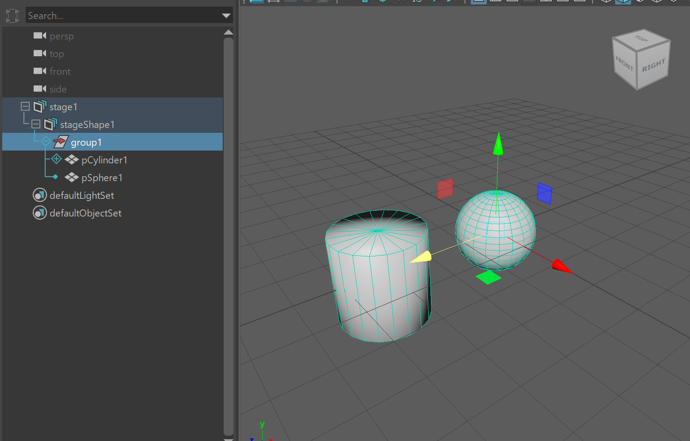
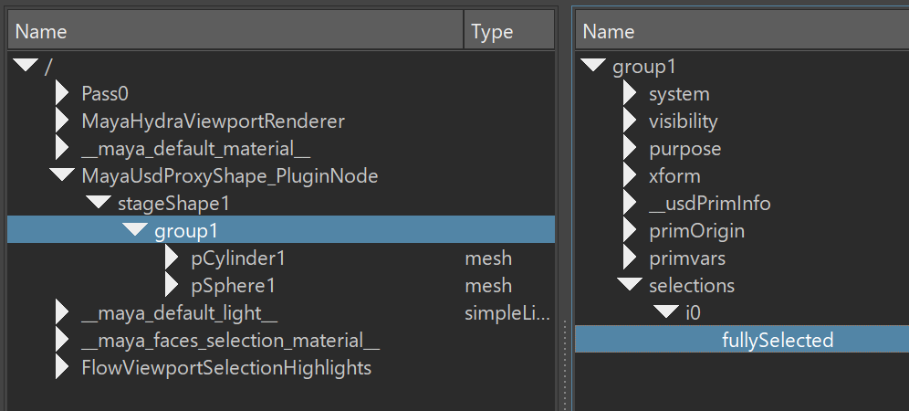
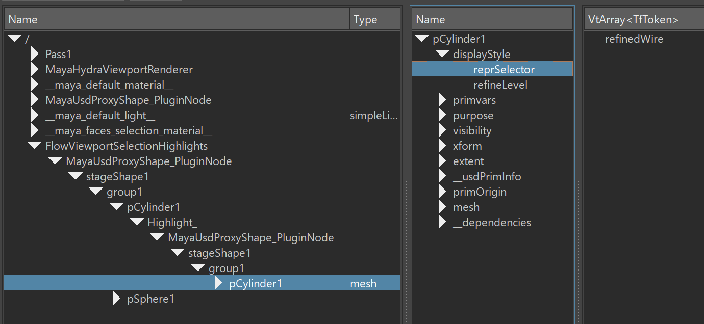
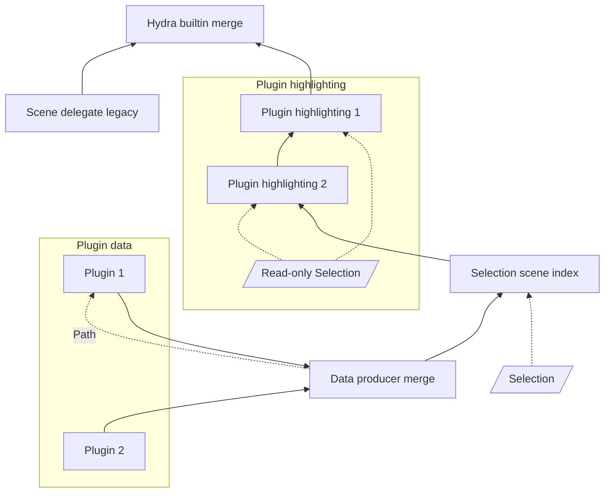
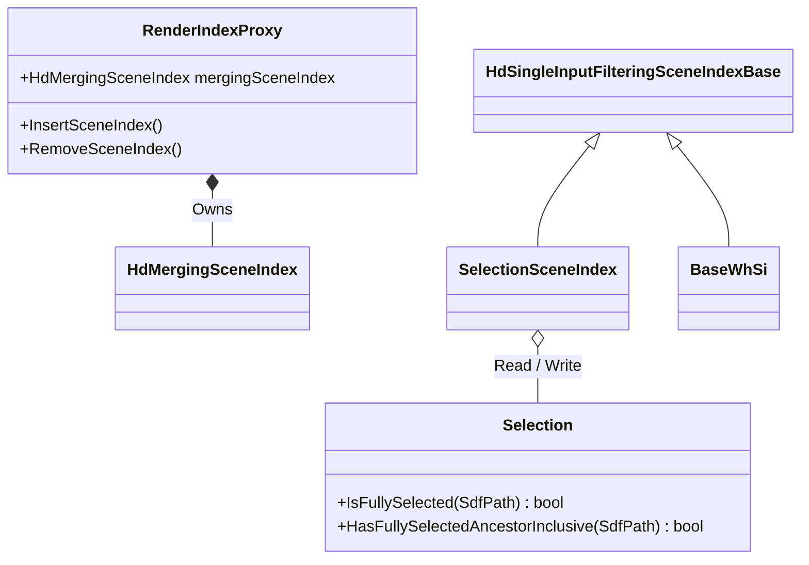

# Selection Highlighting Architecture

Selection highlighting changes the in-viewport appearance of selected objects
or object components.

In the following document we will refer to the software infrastructure that
supports Hydra rendering in this repository as the Flow Viewport Toolkit (name
subject to change).

This document will describe the state of Flow Viewport Toolkit selection
highlighting as of 23-Jan-2025.

## Behavior

Applications maintain a set of selected objects that the user can add to and
remove from.  Selected objects are usually the target of user operations, and
are shown differently in the viewport for ease of understanding.

An application will provide a way to select an object, or to select components
of an object.  For example, for a mesh object, these components may be points,
edges, or faces.  Currently, highlighting is provided for object-level, point 
instancing and native instancing selections of meshes and geomSubsets of faces.

## Selection: Application versus Hydra

The application maintains an edit-friendly version of the scene.  This scene is
translated into a Hydra scene by scene indices.  Correspondingly, there are two
versions of the selection, one in the application, with objects and their paths
described with application-specific classes, and a version of the selection in
the Hydra scene, described as prims and their `SdfPath`s, as well as their
associated selection data sources.

## Requirements

Requirements for selection highlighting are:

- It must be possible to provide selection highlighting in an application that
  supports multiple data models (e.g. Maya data and USD data), and plugins to
  those data models (e.g. Maya plugin nodes).

- Selected prims in the Hydra scene index tree must contain a data source
  indicating their selection state.  This data source is the one used by Pixar
  in Hydra code, and thus is used in usdview.

- Data injecting plugin scene indices must be able to specify their selection
  highlight appearance.

- It must be possible to let a data injecting data model provide prims to Hydra
  that already contain selection highlighting.  Currently,
  this is true of Maya native Dag data, where selection
  highlighting is done by OGS.

## Selection Highlighting Styles

There are at least two approaches to selection highlighting:
- **Added geometry**: adding secondary geometry that indicates the selected
status of objects in the scene, e.g. wireframe or bounding box.
- **Pixed-based modified object appearance**: rendering selected objects in a
special way, e.g. object contour, modified object color, or object overlay.

The former approach is handled by having a plugin provide a selection
highlighting filtering scene index to the Flow Viewport Toolkit, and is the
topic of this document at time of writing.  The latter is handled by having 
a plugin provide a selection highlighting task to the Flow Viewport Toolkit, 
and is currently unimplemented.

## Added Geometry Plugin Software Architecture Requirements

A selection highlighting plugin that provides added geometry to scene must
provide the following services:

- A way to translate the application's selection path(s) into Hydra paths and data sources:
    - So that the appropriate prims in Hydra can be dirtied on selection change.
    - So that selected prims in Hydra can have a data source added.
  This is embodied in a **Path Mapper**.  The plugin must therefore create
  a path mapper and register it in the **Path Mapper Registry**.

- A way for the plugin to query the Hydra version of the application
  selection:
    - So that the plugin can add the appropriate selection highlighting
      geometry on those prims that require it, e.g. a different color for the
      first selected object, or selection highlighting for a complete hierarchy.

## Sample Code
### Selection Change

This
[selection change code](../lib/flowViewport/sceneIndex/fvpSelectionSceneIndex.cpp)
shows the use of the *ufePathToPrimSelections()* utility function.  This
utility accesses the **Path Mapper Registry** and retrieves a path mapper 
that implements the translation of selected application paths to selected 
Hydra scene index paths.  *ufePathToPrimSelections()* then invokes the 
path mapper and returns the Hydra scene index paths.

### Wireframe Selection Highlighting

The [wireframe selection highlighting scene indices](../lib/flowViewport/sceneIndex/wireframeHighlights/)
use the selection data sources on Hydra prims to create corresponding wireframe highlights.
It does not matter to these scene indices where the selection data sources come from; what matters 
is that these scene indices be positioned in the scene index chain after all necessary selection
data source providers have applied their selections.

## Design Option Discussion

- **Plugins use Hydra selection, not application selection**: selection
  highlighting plugins should only deal with the Hydra view of the selection,
  not the application view.  Selected objects should be Hydra prims, and paths
  to them described as `SdfPath`.  This keeps plugins independent of any
  particular application's representation of selection.

- **Plugins create and register a path mapper object** to translate application
  selection paths to Hydra scene index prim selection paths.  Application
  paths are described through the Universal Front End API, with 
  `Ufe::Path`, and Hydra scene index prim paths are described with OpenUSD
  `SdfPath`.  A selection in the application must be translated to a
  selection in the Hydra scene graph, using a path mapper.

  For example, consider a USD stage rooted at application path
  `|stage1|stageShape1`, and a USD prim `/Cube1` in that stage.  This is
  described in the application by the `Ufe::Path` `|stage1|stageShape1,/Cube1`.
  Its corresponding Hydra prim path might be 
  `/MayaUsdProxyShape_PluginNode/mayaUsdProxyShape1/Cube1`.  A Hydra USD data 
  producer plugin can register a path mapper that converts all `Ufe::Path` that
  begin with path prefix `|stage1|stageShape1` to Hydra scene index
  prim paths that begin with the `SdfPath` prefix
  `/MayaUsdProxyShape_PluginNode/mayaUsdProxyShape1`, so that 
  `|stage1|stageShape1,/Cube1` gets mapped into 
  `/MayaUsdProxyShape_PluginNode/mayaUsdProxyShape1/Cube1`.

## Implementation

### Hydra Scene and Viewport Selection Result

The resulting wireframe selection highlighting of USD data is shown here:

The resulting prim selection data source is shown here:

The resulting prim wireframe display style data source is shown here:

### Flow Viewport Toolkit

The complete implementation of selection highlighting is done in a new library
in the maya-hydra repository.  The library is called `flowViewport`, under the
`lib` directory.  The library supports [semantic
versioning](https:/semver.org), with classes in a `Fvp` namespace.
The `Fvp` namespace actually contains the flowViewport major version.  All
flowViewport files have an `fvp` prefix.

The `mayaHydraLib` library and the `mayaHydra` plugin both directly depend on
`flowViewport`.

Having the selection highlighting code in a separate library promotes
reusability and enforces separation of concerns.

### Added Geometry Selection Highlighting Through Scene Indices

The Hydra scene index tree was chosen to implement selection highlighting
through additional geometry.  This is because a scene index can inject
additional prims into the scene, modify data sources of prims in the scene,
and dirty prims in the scene whose selection status has changed.

The scene index tree is now the following:

```mermaid
graph BT;
    lgcy[Scene delegate legacy]-->hm[Hydra builtin merge];
    ph1[Plugin highlighting 1]-->hm;
    subgraph ph[Plugin highlighting]
        ph2[Plugin highlighting 2]-->ph1;
        roSn[/Read-only Selection/]-.->ph1;
        roSn-.->ph2;
    end
    snSi[Selection scene index]-->ph2;
    dpm[Data producer merge]-->snSi;
    subgraph pd[Plugin data]
        p1[Plugin 1];
        p2[Plugin 2];
    end
    dpm-. Path .->p1;
    p1-->dpm;
    p2-->dpm;
    sn[/Selection/]-.->snSi;
```
The plugin data and plugin highlighting subtrees are where plugins add their
scene indices.  The data scene index is required, and the highlighting scene
index is optional.

### Object Modeling

The object modeling is the following:
- **Selection**: builtin provided by the Flow Viewport Toolkit.
    - Encapsulates the Hydra selection as scene index paths and selection data sources.
    - Is used by the selection scene index.
    - May be used by selection highlighting scene indices.
- **Selection scene index**: builtin provided by the Flow Viewport Toolkit.
    - Has a pointer to read and write the Hydra selection.
    - Translates the application selection to Hydra selection.
- **Plugin data scene index**: provided by plugin.
    - Injects plugin data into Hydra
- **Plugin selection highlighting scene index**: provided by plugin.
    - May have a pointer to a read-only view of the Hydra selection
    - Processes dirty selection notifications to dirty the appropriate prim(s)
      in plugin data, including hierarchical selection highlighting
    - Adds required geometry or data sources to implement selection
      highlighting

### New Path Mapper Base Class

The Flow Viewport Toolkit has a new base class:

- **PathMapper**: must be provided by data provider plugins so that Hydra
  can translate selected object application paths to selected Hydra
  prim paths. The plugin provides the concrete implementation of this
  base class, and registers it to the **path mapper registry***.

### Implementation Classes

- **Wireframe selection highlighting scene indices (classes suffixed by WhSi)**: 
    - Use Hydra HdRepr to create wireframe representations of selected objects
      *and their descendants*.
    - Use Hydra selection data sources to determine when & how to create wireframe highlights.
    - Update wireframe highlights when selected prims are dirtied.
- **Render index proxy**:
    - Provides encapsulated access to the data producer merging scene
      index.  This is a standard Hydra merging scene index to which Flow
      Viewport data producers are connected.
    - Other responsibilities to be determined, for future extension, possibly a
      [facade design pattern](https://en.wikipedia.org/wiki/Facade_pattern).

### Class Diagram

```mermaid
classDiagram
class HdSingleInputFilteringSceneIndexBase
class HdMergingSceneIndex

class Selection{
+IsFullySelected(SdfPath) bool
+HasFullySelectedAncestorInclusive(SdfPath) bool
}

class SelectionSceneIndex
class BaseWhSi

class RenderIndexProxy{
+HdMergingSceneIndex mergingSceneIndex
+InsertSceneIndex()
+RemoveSceneIndex()
}

HdSingleInputFilteringSceneIndexBase <|-- SelectionSceneIndex

HdSingleInputFilteringSceneIndexBase <|-- BaseWhSi

RenderIndexProxy *-- HdMergingSceneIndex : Owns

SelectionSceneIndex o-- Selection : Read / Write
```

## Algorithmic Complexity

- In the Flow Viewport Selection, for an n-element selection, membership lookup is O(log n)
  (map of SdfPath).  Ancestor membership lookup is O(n), as we loop through
  each selected path and inspect the selected path prefix.  This could be much
  improved (to amortized O(k), for a k-element path) through the use of a
  prefix trie, such as `Ufe::Trie`.

## Limitations

- Little investigation of pixel-based selection highlighting capability.
    - Needs task-based approach.
    - Needs selection tracker object to make selection and data derived from
      the selection available to tasks through the task context data

- No selection highlighting across scene indices: selection state propagates
  down app scene hierarchy, so that when an ancestor is selected, a
  descendant's appearance may change.  This can mean selection state must
  propagate across scene index inputs, so that if a Maya Dag ancestor is
  selected, a USD descendant's appearance can change.  This is the same
  situation as global transformation and visibility.
