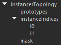
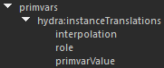
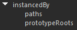
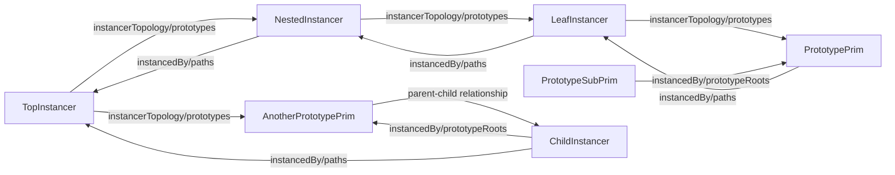

# Flow Viewport wireframe selection highlighting scene indices

## <u>Requirements</u>
The selection highlight framework is designed to fit the following requirements :
- Each selection highlight must be able to have its own color
- Selection highlights should not pollute the original scene index hierarchy
- A single prim may have multiple independent selection highlights

## <u>Brief overview</u>
The logic for wireframe highlighting is split up across multiple scene indices, 
each dedicated to handling highlights for a specific type of prim. The common 
logic between them is extracted out in a base class, which makes each scene index 
independent of each other. See the BaseWhSi.h doc comment for an explanation on how 
selection highlights are structured.

Note that sets & maps keyed by SdfPaths are heavily used in order to accelerate 
finding the children and/or parents of paths among a given collection of paths
by leveraging SdfPaths' lexicographical ordering. Utility methods FindSelfOrFirstChild 
and FindSelfOrFirstParent are provided in fvpUtils.h to make this process less tedious.

## <u>Testing</u>
Highlighting tests use image-based tests, as we don't care all that much about how the 
highlight prims are structured as opposed to how the result looks. And since there are 
a lot of cases to handle, it is much faster & simpler to go with image-based tests (and 
it also allows us to easily see if a case actually works or not).

## <u>Possible improvements/alternatives for the future</u> :
- Currently, to handle wireframe color changes, the `MhDirtyLeadObjectSceneIndex` also 
  forwards the dirty notifications to instancers' prototypes. However, this could be 
  handled by the instancing-related highlight scene indices instead in order to reduce 
  the amount of notifications sent.
- Extract out the common logic between PiInstancerWhSi and PiPrototypeWhSi.
- The mesh scene index currently includes all of the mesh's parents and children in its 
  sub-hierarchy, but we could potentially do like the geomSubset scene index and only 
  return the mesh itself.
- Extract out the shared logic found in the `BaseWhSi` class into a single driver class, 
  which would control the specialized scene indices. This would avoid having each scene 
  index repeat the processing of the `BaseWhSi` and maintain separate copies of the fully 
  selected paths.
- Instead of tracking fully selected paths in a standalone manner and re-implementing 
  `HasFullySelectedAncestorInclusive`, hook the scene indices to the Flow Viewport 
  selection and use the `Fvp::Selection`'s version of the method. This would also require 
  the `Fvp::Selection` to send out notifications whenever a path starts or stops being 
  fully selected to accomodate `ProcessFullySelectedChange`.
- HYDRA-1407 : When both a mesh and a geomSubset highlight coexist, the mesh highlight 
  will always show up on top of the geomSubset highlight, which can lead to incorrect 
  colors.

## <u>Instancing scene index structure</u>

This section will help with understanding how instancing in Hydra works,
and thus how highlighting works for point & native instancing.

In Hydra, an instancer is represented as a prim of type `instancer`,
with an `instancerTopology` data source. 



This data source always contains the following inner data sources :
- The `prototypes` data source, of type `VtArray<SdfPath>`, lists the paths
to each prototype this instancer instances.
- The `instanceIndices` data source, a vector data source where each element
data source (`i0, i1, i2, etc.`) is of type `VtArray<int>` and contains
which instances correspond to which prototype. For example, if `i1` contains
`0, 3`, then the first and fourth instances will be using the second prototype.
- The `mask` data source, of type `VtArray<bool>`, which can optionally be used
to show/hide specific instances (e.g. if the 3rd element of the mask is `false`,
then the 3rd instance will be hidden). If this array is empty, all instances will be
shown.

If the instancer is an implicit instancer used for native instancing, an additional
data source will also be present :
- The `instanceLocations` data source, of type `VtArray<SdfPath>`, lists the paths
to each original instance that was coalesced by this instancer.

---

Per-instance data is specified using primvar data sources, namely :
- hydra:instanceTranslations
- hydra:instanceRotations
- hydra:instanceScales
- hydra:instanceTransforms



Where the corresponding primvarValue data source lists the instance-specific data.
Note that while the first three are 3-dimensional vectors and `hydra:instanceTransforms`
is a 4x4 matrix, they can all be used simultaneously (internally, they will all be
converted to 4x4 matrices, and then multiplied together).

---

On the other end of instancing, prototype prims have an `instancedBy` data source.



This data source contains up to two inner data sources :
- (required) : The `paths` data source, of type `VtArray<SdfPath>`, lists the paths
to each instancer that instances this prototype.
- (optional) : When a sub-hierarchy is prototyped, the `prototypeRoots`, of type 
`VtArray<SdfPath>`, lists the paths to the roots of the sub-hierarchies that are being 
prototyped. For example, if we are instancing an xform that has a child mesh,
then the prototype xform and mesh prims will each have the same `instancedBy` data source,
where the `paths` data source will point to the instancers that use this prototype, and
where the `prototypeRoots` will point to the xform prim.

---

Some notes about the behavioral impacts of the hierarchical location of prims :
- Prims that are rooted under an instancer will not be drawn unless instanced
- Prototypes that are instanced will still be drawn as if they were not instanced
(i.e. the instances will be drawn in addition to the base prim itself), unless as 
mentioned they are rooted under an instancer.

---

#### <i>Nested/Composed point instancers</i>

It is possible for an instancer itself to be instanced by another, and thus have both the
`instancerTopology` and the `instancedBy` data sources. Note that this does not preclude
such a prototyped instancer from also drawing geometry itself. If the prototyped instancer 
is a child of the instancing instancer, then yes, such a nested instancer will not draw by
itself, and will be instance-drawn through the parent instancer. However, if the prototyped
instancer has no parent instancer, but it is instanced by another instancer somewhere else
in the hierarchy, then both the prototyped instancer will draw as if it were by itself, but
also be instance-drawn by the other instancer.

This nesting and composition of instancers is what leads to most of the complexity of point 
instancing selection highlighting. We can view such nesting and composition of instancers as 
graphs, with the vertices being the instancer prims, and the edges being the paths contained 
in the `instancerTopology/prototypes`, `instancedBy/paths` and `instancedBy/prototypeRoots` 
data sources, as well as parent-child relationships.

For example, given the following scene structure :
```
Root
|__TopInstancer
|  |__NestedInstancer
|  |  |__LeafInstancer
|  |     |__PrototypePrim
|  |        |__PrototypeSubPrim
|__AnotherPrototypePrim
   |__ChildInstancer
```

We can assemble the following graph :



When creating highlights with point instancing, we traverse this graph and collect all the 
relevant root instancer and root prototype paths. This allows us to create a highlight
sub-hierarchy containing only the prims relevant to the instancing graph the selected prim
is a part of.

Of note are the following selection highlighting scenarios and their corresponding behaviors :
- Selecting a point instancer in its entirety
  - If the instancer is a top-level instancer, all instances it draws WILL be highlighted.
  - If the instancer is a prototype, instances of itself drawn by other instancers will NOT be highlighted. 
    This is an intentional workflow decision from the Hydra for Maya team.
- Selecting specific instances of point instancer
  - If the instancer is a top-level instancer, the selected instances it draws WILL be highlighted.
  - If the instancer is a prototype, the instances it would indirectly draw through instances of itself drawn by other instancers will NOT be highlighted. 
    This is an intentional workflow decision from the Hydra for Maya team.
- Selecting a parent prim of a point instancer
  - (same as selecting a point instancer in its entirety)
